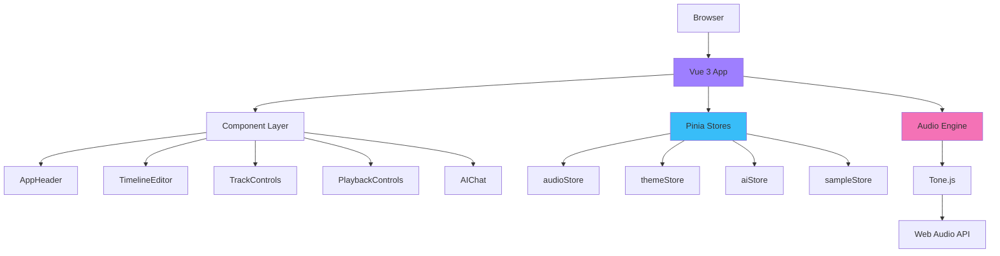
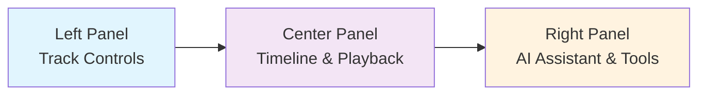
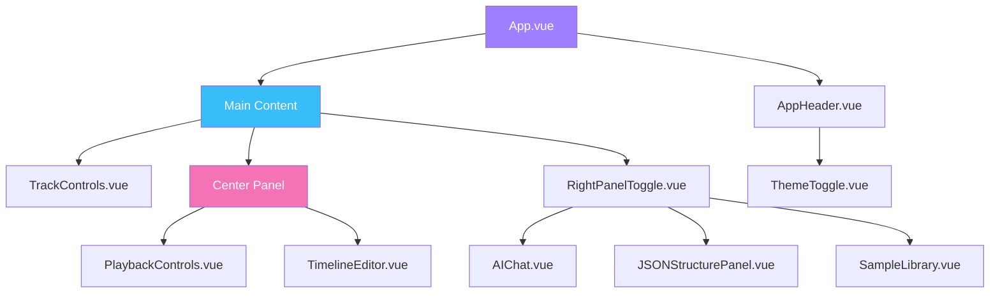
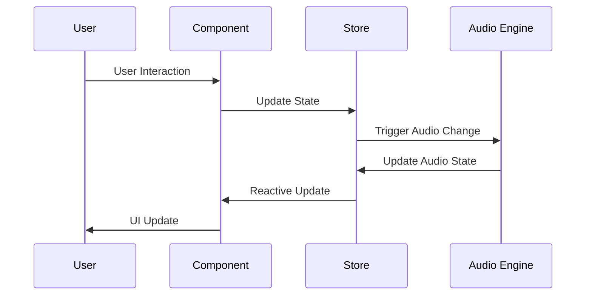
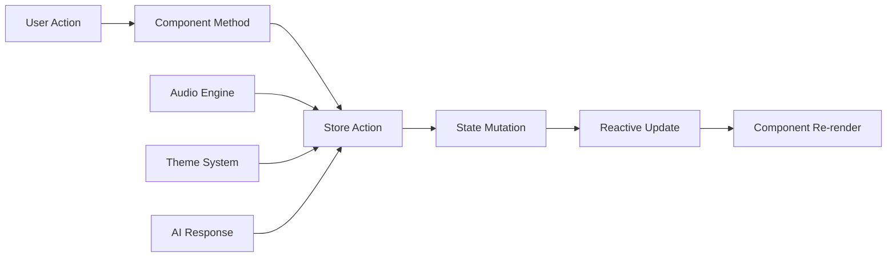
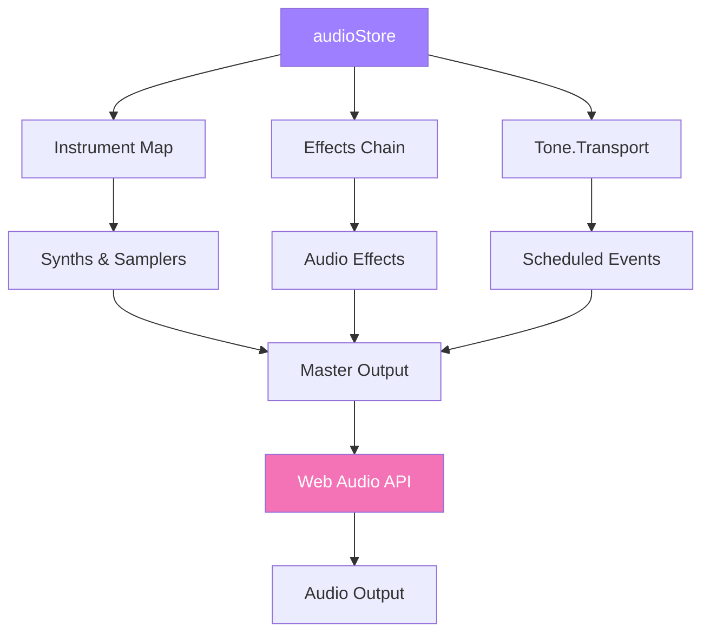
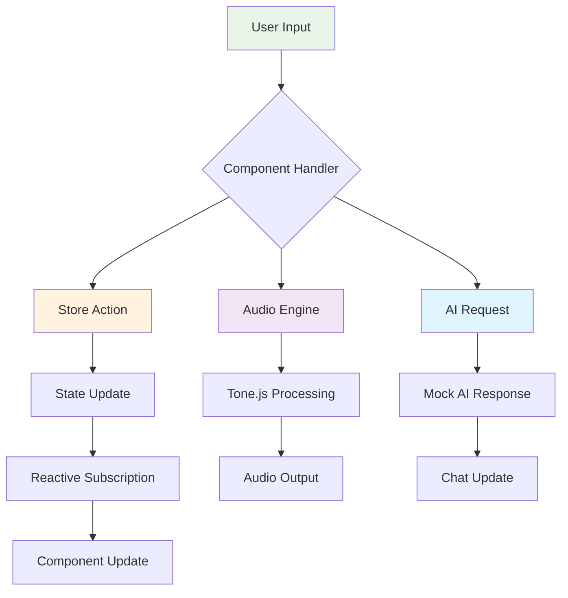
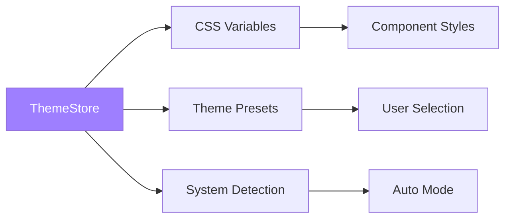
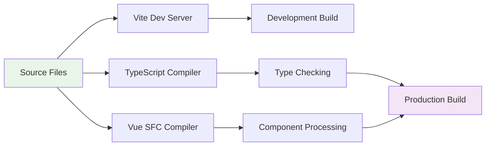

# mITyStudio Architecture

mITyStudio is a modern web-based music production application built with Vue 3, TypeScript, and Vite. It provides an AI-powered digital audio workstation (DAW) experience in the browser, featuring real-time audio processing, multi-track editing, and intelligent music composition assistance.

## Table of Contents

- [Overview](#overview)
- [Technology Stack](#technology-stack)
- [Repository Structure](#repository-structure)
- [Core Architecture](#core-architecture)
- [Component Architecture](#component-architecture)
- [State Management](#state-management)
- [Audio Engine](#audio-engine)
- [Data Flow](#data-flow)
- [Internationalization](#internationalization)
- [Theming System](#theming-system)
- [Build System](#build-system)
- [Development Guidelines](#development-guidelines)

## Overview

mITyStudio follows a component-based architecture with clear separation of concerns:

- **Presentation Layer**: Vue 3 components with TypeScript
- **State Management**: Pinia stores for reactive data management
- **Audio Processing**: Tone.js integration for Web Audio API
- **Styling**: CSS custom properties with theme system
- **Build**: Vite for fast development and optimized production builds



## Technology Stack

### Core Framework
- **Vue 3**: Progressive JavaScript framework with Composition API
- **TypeScript**: Type-safe JavaScript development
- **Vite**: Next-generation frontend build tool

### State Management
- **Pinia**: Intuitive, type-safe state management for Vue

### Audio Processing
- **Tone.js**: Framework for creating interactive music in the browser
- **Web Audio API**: Low-level audio processing capabilities

### UI & Styling
- **CSS Custom Properties**: Theme-aware styling system
- **Lucide Icons**: Modern SVG icon library
- **Responsive Design**: Mobile-first approach

### Development Tools
- **Vue DevTools**: Vue-specific debugging
- **TypeScript Compiler**: Static type checking
- **ESLint**: Code quality and style consistency

### Internationalization
- **Vue I18n**: Vue internationalization plugin
- **JSON Locale Files**: Structured translation management

## Repository Structure

```
mITyStudio/
├── public/                     # Static assets
├── src/                       # Source code
│   ├── components/           # Vue components
│   │   ├── AppHeader.vue    # Main navigation and project controls
│   │   ├── TimelineEditor.vue # Audio timeline and sequencer
│   │   ├── TrackControls.vue # Track management panel
│   │   ├── PlaybackControls.vue # Transport controls
│   │   ├── AIChat.vue       # AI assistant interface
│   │   ├── ThemeToggle.vue  # Theme switching component
│   │   └── ...              # Additional UI components
│   ├── stores/              # Pinia state stores
│   │   ├── audioStore.ts    # Audio engine and song data
│   │   ├── themeStore.ts    # Theme and appearance
│   │   ├── aiStore.ts       # AI assistant state
│   │   └── sampleStore.ts   # Sample library management
│   ├── locales/             # Internationalization files
│   │   ├── en.json          # English translations
│   │   └── es.json          # Spanish translations
│   ├── assets/              # Static assets (images, fonts)
│   ├── App.vue              # Root application component
│   ├── main.ts              # Application entry point
│   └── style.css            # Global styles and CSS variables
├── index.html               # HTML entry point
├── package.json             # Project dependencies and scripts
├── tsconfig.json            # TypeScript configuration
├── vite.config.ts           # Vite build configuration
└── README.md                # Project documentation
```

## Core Architecture

### Application Layout

The application follows a three-panel layout:



### Component Hierarchy



## Component Architecture

### Core Components

#### AppHeader.vue
- **Purpose**: Main navigation and project management
- **Features**: New/Open/Save project, export functionality, language selection
- **Dependencies**: audioStore, themeStore, i18n

#### TimelineEditor.vue
- **Purpose**: Multi-track audio timeline and sequencer
- **Features**: Track visualization, clip editing, timeline navigation
- **Dependencies**: audioStore, drag-and-drop functionality

#### TrackControls.vue
- **Purpose**: Individual track management
- **Features**: Volume/pan controls, track selection, effects
- **Dependencies**: audioStore

#### PlaybackControls.vue
- **Purpose**: Transport controls and audio playback
- **Features**: Play/pause/stop, loop, metronome, master volume
- **Dependencies**: audioStore, Tone.js integration

#### AIChat.vue
- **Purpose**: AI-powered music production assistant
- **Features**: Chat interface, music analysis, composition suggestions
- **Dependencies**: aiStore, audioStore

### Component Communication

Components communicate through:

1. **Props**: Parent-to-child data passing
2. **Events**: Child-to-parent communication
3. **Pinia Stores**: Shared state management
4. **Provide/Inject**: Deep component tree communication



## State Management

### Store Architecture

The application uses Pinia for state management with four main stores:

#### audioStore.ts
- **Responsibility**: Audio engine, song structure, playback state
- **Key State**:
  - `songStructure`: Current project data
  - `isPlaying`: Playback status
  - `tracks`: Audio track configuration
  - `instruments`: Tone.js instrument instances

#### themeStore.ts
- **Responsibility**: UI theming and appearance
- **Key State**:
  - `mode`: Light/dark/auto theme mode
  - `currentTheme`: Active theme colors
  - `presetThemes`: Available theme presets

#### aiStore.ts
- **Responsibility**: AI assistant functionality
- **Key State**:
  - `messages`: Chat conversation history
  - `isGenerating`: AI response generation status
  - `selectedProvider`: AI service provider

#### sampleStore.ts
- **Responsibility**: Audio sample library management
- **Key State**:
  - `localSamples`: Available audio samples
  - `selectedCategory`: Sample filtering
  - `isLoading`: Sample loading status

### State Flow



## Audio Engine

### Tone.js Integration

The audio engine is built on Tone.js, which provides:

- **Web Audio API abstraction**
- **Scheduling and timing**
- **Audio effects and instruments**
- **Transport controls**

#### Audio Architecture



#### Key Audio Features

1. **Multi-track playback**
2. **Real-time audio synthesis**
3. **Audio effects processing**
4. **Metronome and click track**
5. **Loop functionality**
6. **Master volume control**

### Song Structure

```typescript
interface SongStructure {
  id: string
  name: string
  tempo: number
  timeSignature: [number, number]
  key: string
  tracks: Track[]
  duration: number
  createdAt: string
  updatedAt: string
}

interface Track {
  id: string
  name: string
  instrument: string
  volume: number
  pan: number
  muted: boolean
  solo: boolean
  clips: AudioClip[]
  effects: EffectSettings
}
```

## Data Flow

### Application Data Flow



### Event Flow Examples

#### Playing Audio
1. User clicks play button
2. PlaybackControls component calls `audioStore.play()`
3. Store updates `isPlaying` state
4. Tone.Transport starts playback
5. UI updates to show playing state

#### Adding a Track
1. User clicks "Add Track" in TrackControls
2. Component calls `audioStore.addTrack()`
3. Store creates new track object
4. TimelineEditor reactively displays new track
5. Audio instruments are initialized

## Internationalization

### i18n Architecture

The application supports multiple languages using Vue I18n:

- **Locale files**: JSON structure for translations
- **Global injection**: Available in all components
- **Reactive switching**: Dynamic language changes
- **Fallback system**: Default to English

```typescript
// Locale structure example
{
  "tracks": {
    "title": "Tracks",
    "addTrack": "Add Track",
    "volume": "Volume"
  },
  "playback": {
    "play": "Play",
    "pause": "Pause",
    "stop": "Stop"
  }
}
```

## Theming System

### CSS Custom Properties

The theming system uses CSS custom properties for dynamic styling:

```css
:root {
  --primary: #9E7FFF;
  --secondary: #38bdf8;
  --background: #171717;
  --surface: #262626;
  --text: #FFFFFF;
}
```

### Theme Management



### Available Themes

- **Light Theme**: Clean, bright interface
- **Dark Theme**: Low-light optimized
- **Auto Theme**: System preference detection
- **Custom Presets**: Ocean, Forest, Sunset, Midnight

## Build System

### Vite Configuration

Vite provides:

- **Fast development server** with HMR
- **Optimized production builds**
- **TypeScript support**
- **Vue SFC processing**

### Build Process



### Scripts

- `npm run dev`: Development server
- `npm run build`: Production build
- `npm run preview`: Preview production build

## Development Guidelines

### Code Organization

1. **Components**: Single-file Vue components with `<script setup>`
2. **Stores**: Pinia stores with TypeScript interfaces
3. **Types**: Shared interfaces in store files
4. **Styles**: Scoped CSS with custom properties

### Best Practices

1. **Type Safety**: Use TypeScript interfaces for all data structures
2. **Reactive State**: Leverage Vue's reactivity system
3. **Component Composition**: Keep components focused and reusable
4. **Store Patterns**: Use stores for cross-component state
5. **Audio Handling**: Properly manage Tone.js resources

### Performance Considerations

1. **Lazy Loading**: Components loaded on demand
2. **Audio Resource Management**: Dispose of unused instruments
3. **Reactive Optimization**: Use computed properties for derived state
4. **CSS Efficiency**: Leverage custom properties for theming

### Testing Strategy

- **Component Testing**: Vue Test Utils for component logic
- **Store Testing**: Pinia testing utilities
- **Audio Testing**: Mock Tone.js for audio functionality
- **E2E Testing**: Cypress for full application workflows

## Design Decisions

### Technology Choices

1. **Vue 3 over React**: Better TypeScript integration, Composition API
2. **Pinia over Vuex**: Simpler API, better TypeScript support
3. **Tone.js over Web Audio**: Higher-level abstraction, music-focused
4. **Vite over Webpack**: Faster development, simpler configuration

### Architecture Patterns

1. **Composition API**: Modern Vue development pattern
2. **Store-based State**: Centralized state management
3. **Component-based UI**: Reusable, maintainable components
4. **CSS Custom Properties**: Dynamic theming capability

## Future Considerations

### Scalability

- **Module Federation**: Micro-frontend architecture
- **Service Workers**: Offline functionality
- **WebAssembly**: Performance-critical audio processing
- **Real-time Collaboration**: Multi-user editing

### Feature Roadmap

- **Advanced Audio Effects**: Convolution reverb, granular synthesis
- **MIDI Support**: Hardware controller integration
- **Cloud Storage**: Project synchronization
- **Plugin System**: Third-party extensions

## Related Documentation

Since this is the primary architectural document for the repository, additional documentation can be found in:

- **README.md**: Project overview, setup instructions, and basic usage
- **Inline Code Documentation**: TypeScript interfaces and component documentation within source files
- **Component Files**: Each Vue component contains inline documentation for its specific functionality
- **Store Files**: Pinia stores include detailed interface definitions and method documentation

For new contributors, we recommend:

1. Start with this architecture document to understand the overall structure
2. Read the README.md for setup instructions
3. Explore individual component files to understand specific implementations
4. Review store files to understand state management patterns

## Application Interface

mITyStudio features a modern three-panel layout designed for efficient music production workflow:


### Interface Layout

The application is organized into three main sections:

1. **Track Controls Panel (Left)**
   - Track management and instrument selection
   - Volume, pan, and effect controls
   - Mute, solo, and delete track options
   - Real-time parameter adjustment

2. **Timeline Editor (Center)**
   - Musical timeline with measure markers
   - Playback controls (Play, Stop, Loop, Metronome)
   - Key signature and tempo controls
   - Zoom and navigation controls
   - Audio engine status display

3. **Right Panel (Samples/AI/Settings)**
   - Sample library management
   - AI assistant for music composition
   - JSON song structure viewer
   - Application settings

### Key Features Shown

- **Multiple Track Support**: Create and manage multiple instrument tracks
- **Professional Controls**: Industry-standard mixing controls for each track
- **Audio Engine**: Real-time audio processing with Tone.js
- **Responsive Design**: Optimized layout for various screen sizes
- **Dark Theme**: Professional dark interface for reduced eye strain

## Contributing

When contributing to mITyStudio, please:

- Follow the established architectural patterns described in this document
- Maintain type safety with TypeScript
- Use Pinia stores for state management
- Follow Vue 3 Composition API best practices
- Ensure proper audio resource cleanup
- Update this architecture document for significant structural changes

---

For more detailed information about specific components or systems, refer to the inline documentation in the respective source files.
=======
## Overview

mITyStudio is a modern web-based digital audio workstation (DAW) built with Vue 3, TypeScript, and Vite. The application provides AI-powered music composition tools and a comprehensive audio production environment.

## Technology Stack

- **Frontend Framework**: Vue 3 with Composition API
- **Language**: TypeScript
- **Build Tool**: Vite
- **State Management**: Pinia
- **Audio Processing**: Tone.js
- **HTTP Client**: Axios
- **Internationalization**: Vue I18n
- **Icons**: Lucide Vue Next
- **Utilities**: VueUse

## Project Structure

```
src/
├── components/          # Vue components
├── stores/             # Pinia stores for state management
├── assets/             # Static assets
├── locales/            # Internationalization files
├── style.css          # Global styles
└── main.ts            # Application entry point
```

## Core Components

### AIChat

AI Chat Component Provides an intelligent chat interface for music composition assistance. Features real-time AI responses, contextual suggestions, and integration with the main audio production workflow.

**Features:**
- AI Chat Integration
- Audio Processing
- Timeline Editing

**Location:** `src/components/AIChat.vue`

### AppHeader

Main application header with navigation and controls

**Features:**
- Audio Processing
- Theme Management

**Location:** `src/components/AppHeader.vue`

### JSONStructurePanel

Side panel component with various tools and settings

**Features:**
- Audio Processing

**Location:** `src/components/JSONStructurePanel.vue`

### PlaybackControls

Audio playback and control component

**Features:**
- Audio Processing

**Location:** `src/components/PlaybackControls.vue`

### RightPanelToggle

Side panel component with various tools and settings

**Features:**
- AI Chat Integration
- Audio Processing
- Theme Management
- Sample Management
- Timeline Editing

**Location:** `src/components/RightPanelToggle.vue`

### SampleLibrary

Sample library management and organization

**Features:**
- Audio Processing
- Sample Management

**Location:** `src/components/SampleLibrary.vue`

### ThemeToggle

Theme management and customization component

**Features:**
- Theme Management

**Location:** `src/components/ThemeToggle.vue`

### TimelineEditor

Timeline editor for arranging musical elements

**Features:**
- Audio Processing
- Sample Management
- Timeline Editing

**Location:** `src/components/TimelineEditor.vue`

### TrackControls

Individual track controls and management

**Features:**
- Audio Processing
- Sample Management
- Timeline Editing

**Location:** `src/components/TrackControls.vue`


## State Management (Pinia Stores)

### Ai Store

Manages application state

**State Variables:**
- `isGenerating`
- `selectedProvider`
- `selectedModel`

**Actions:**
- `addMessage()`
- `clearMessages()`
- `setProvider()`
- `setModel()`
- `getAvailableModels()`

**Location:** `src/stores/aiStore.ts`

### Audio Store

Manages application state

**State Variables:**
- `isPlaying`
- `currentTime`
- `isLooping`
- `metronomeEnabled`
- `masterVolume`
- `zoom`
- `isInitialized`
- `isInitializing`

**Actions:**
- `scheduleClip()`
- `scheduleMetronome()`
- `clearScheduledEvents()`
- `generateAndScheduleSong()`
- `pause()`
- `stop()`
- `setTempo()`
- `addTrack()`
- `removeTrack()`
- `updateTrack()`
- `addClip()`
- `removeClip()`
- `updateClip()`
- `updateSongStructure()`
- `loadSongStructure()`
- `exportSongStructure()`
- `toggleLoop()`
- `toggleMetronome()`
- `setMasterVolume()`
- `setZoom()`
- `selectTrack()`
- `resetAudio()`

**Location:** `src/stores/audioStore.ts`

### Sample Store

Manages application state

**State Variables:**
- `isLoading`
- `loadingProgress`
- `searchQuery`

**Actions:**
- `removeSample()`
- `updateSampleCategory()`
- `updateSampleTags()`
- `clearAllSamples()`
- `exportSampleLibrary()`
- `getSample()`

**Location:** `src/stores/sampleStore.ts`

### Theme Store

Manages application state

**State Variables:**
- `systemPrefersDark`

**Actions:**
- `setMode()`
- `toggleMode()`
- `applyTheme()`
- `updateMetaThemeColor()`
- `detectSystemTheme()`
- `saveToStorage()`
- `loadFromStorage()`
- `initializeTheme()`
- `applyPresetTheme()`

**Location:** `src/stores/themeStore.ts`


## Key Features

1. **AI-Powered Composition**: Integrated AI chat for music creation assistance
2. **Audio Production**: Full timeline editor with track management
3. **Sample Library**: Comprehensive sample management and organization
4. **Theme System**: Customizable themes with light/dark mode support
5. **Real-time Audio**: WebAudio-based audio processing with Tone.js
6. **Internationalization**: Multi-language support

## Data Flow

1. **User Interactions**: Components handle user input and emit events
2. **State Updates**: Pinia stores manage application state changes
3. **Audio Processing**: Tone.js handles real-time audio synthesis and effects
4. **AI Integration**: AI store manages chat interactions and responses

## Development Workflow

1. **Development Server**: `npm run dev`
2. **Production Build**: `npm run build`
3. **Preview**: `npm run preview`

## Browser Compatibility

- Modern browsers with WebAudio API support
- ES6+ JavaScript support required
- WebRTC support recommended for advanced features

*This documentation is automatically generated. Last updated: 2025-07-05T11:58:40.747Z*
