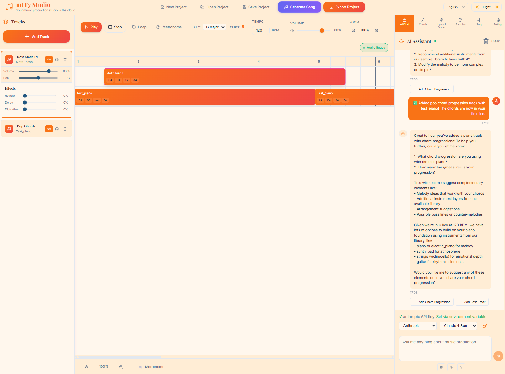

# mITyStudio - Revolutionary AI Music Composition Studio

## 📖 Table of Contents

- [Why Choose mITyStudio?](#-why-choose-mitystudio)
  - [Create Music Like Never Before](#create-music-like-never-before)
  - [Perfect For Everyone](#perfect-for-everyone)
  - [Key Benefits](#key-benefits)
- [Get Started in 3 Simple Steps](#-get-started-in-3-simple-steps)
  - [1. Quick Installation](#1-quick-installation)
  - [2. Launch & Create](#2-launch--create)
  - [3. Compose Your First Song](#3-compose-your-first-song)
- [For Developers](#️-for-developers)
  - [Features](#features)
  - [Song Structure JSON Contract](#song-structure-json-contract)
  - [Getting Started](#getting-started)
  - [Project Structure](#️-project-structure)
  - [Architecture](#-architecture)
  - [AI Features](#-ai-features)
  - [Environment Configuration](#-environment-configuration)
  - [Development Scripts](#-development-scripts)
  - [Contributing](#-contributing)

---
**Transform your musical ideas into professional compositions with the power of artificial intelligence.**

mITyStudio is a complete AI-powered music production suite that empowers musicians, producers, and creators to compose, arrange, and produce high-quality music with unprecedented ease and creativity.



## 🎵 Why Choose mITyStudio?

### **Create Music Like Never Before**
- **AI-Powered Composition**: Generate melodies, harmonies, and arrangements instantly
- **Intelligent Voice Synthesis**: Transform lyrics into professional vocal performances
- **Real-Time Collaboration**: Work with AI assistants that understand music theory
- **Professional Quality**: Studio-grade audio processing and effects

### **Perfect For Everyone**
- **Beginners**: No music theory required - let AI guide your creativity
- **Professionals**: Advanced tools for complex compositions and arrangements
- **Content Creators**: Quickly generate royalty-free music for videos and projects
- **Educators**: Teach music composition with interactive AI assistance

### **Key Benefits**
- ⚡ **10x Faster Composition**: Create complete songs in minutes, not hours
- 🎯 **Professional Results**: Industry-standard audio quality and mixing
- 🧠 **AI Learning**: The more you use it, the better it understands your style
- 💰 **Cost Effective**: Replace expensive studio time and session musicians

## 🚀 Get Started in 3 Simple Steps

### 1. **Quick Installation**

**Windows:**
```bash
setup.bat
```

### 2. **Launch & Create**
Start the application and begin composing immediately:

```bash
start.bat    # Windows
```

### 3. **Compose Your First Song**

Choose your preferred creation method:

#### **🎨 Manual Composition**
- Select instruments from our extensive library
- Choose from AI-trained vocal models
- Build your arrangement track by track
- Fine-tune every detail to your vision

#### **💬 Vibe-Based Creation with AI Chat**
- Describe your musical vision to our AI assistant
- Get real-time suggestions for chords, melodies, and arrangements
- Collaborate naturally: "Make it more upbeat" or "Add a jazz influence"
- Watch your ideas transform into music instantly

#### **🤖 Full AI Song Generation**
- Let our multi-agent system create complete compositions
- Specify genre, mood, tempo, and key elements
- AI handles melody, harmony, rhythm, and structure
- Generate professional songs in minutes with minimal input

#### **🎯 Export & Share**
- Professional-quality audio rendering
- Multiple format support (WAV, MP3, MIDI)
- Stem separation for advanced mixing
- Direct sharing to social platforms


---

## 🛠️ For Developers

<details>
<summary>Technical Documentation & Setup</summary>

# mITyStudio - AI-Powered Music Composition Studio

A complete monorepo structure for an AI-powered music composition and production studio, featuring a Vue.js frontend, Python Flask backend, and Electron desktop application.

## Features

- **Voice Training with WAV Format**: Automatic conversion to WAV format for optimal voice training quality
- **Advanced AI-powered music composition and voice synthesis**
- **Real-time audio processing and effects**
- **Extended Vocal Structure**: Syllable-level note mapping with IPA phonemes for precise vocal synthesis
- **Song Section Management**: Structured song organization with intro, verse, chorus sections
- **Cross-Boundary Clip Support**: Clips can span multiple song sections seamlessly
- **Melisma Detection**: Automatic detection and marking of extended vocal runs
- **Multi-Voice Harmony**: Support for multiple vocal tracks with stereo positioning

## Song Structure JSON Contract

The song structure is represented as a JSON object with the following schema:

```jsonc
{
  "id": "string",                // Unique song/project ID
  "name": "string",              // Song/project name
  "tempo": 120,                  // Tempo in BPM
  "timeSignature": [4, 4],       // Time signature as [beats per bar, note value]
  "key": "C",                    // Musical key (e.g., "C", "G", "Am")
  "structure": {                 // Song structure with sections
    "sections": [
      {
        "id": "sec-intro",       // Unique section ID
        "type": "intro",         // Section type (intro, verse, chorus, bridge, outro)
        "label": "Intro",        // Display label
        "startTime": 0.0,        // Start time in seconds
        "endTime": 8.0,          // End time in seconds
        "index": 1               // Section index for ordering
      },
      {
        "id": "sec-v1",
        "type": "verse",
        "label": "Verse 1",
        "startTime": 8.0,
        "endTime": 24.0,
        "index": 1
      },
      {
        "id": "sec-chorus",
        "type": "chorus",
        "label": "Chorus",
        "startTime": 24.0,
        "endTime": 40.0,
        "index": 1
      }
    ]
  },
  "tracks": [                    // Array of track objects
    {
      "id": "string",            // Unique track ID
      "name": "string",          // Track name
      "instrument": "string",    // Instrument type (e.g., "piano", "drums")
      "category": "string",      // Instrument category (keyboards, strings, etc.)
      "volume": 0.8,             // Track volume (0.0 - 1.0)
      "pan": 0,                  // Stereo pan (-1.0 left to 1.0 right)
      "muted": false,            // Mute state
      "solo": false,             // Solo state
      "clips": [                 // Array of audio/midi clips
        {
          "id": "string",        // Unique clip ID
          "trackId": "string",   // Parent track ID
          "startTime": 0,        // Start time in seconds
          "duration": 4,         // Duration in seconds
          "type": "synth",       // "synth", "sample", or "lyrics"
          "instrument": "string",// Instrument or sample name
          "notes": ["C4"],       // (Optional) Array of note names
          "sampleUrl": "string", // (Optional) URL for sample
          "volume": 1.0,         // Clip volume
          "effects": {           // Clip effects
            "reverb": 0,
            "delay": 0,
            "distortion": 0,
            "pitchShift": 0,
            "chorus": 0,
            "filter": 0,
            "bitcrush": 0
          },
          "waveform": []         // (Optional) Array of waveform data
        }
      ],
      "effects": {               // Track effects
        "reverb": 0,
        "delay": 0,
        "distortion": 0,
        "pitchShift": 0,
        "chorus": 0,
        "filter": 0,
        "bitcrush": 0
      },
      "sampleUrl": "string",     // (Optional) URL for track sample
      "isSample": false          // (Optional) Is this a sample track
    },
    {
      "id": "track-soprano",
      "name": "Soprano Voice",
      "instrument": "vocals",
      "category": "vocals",
      "voiceId": "soprano01",    // Voice identifier for this track
      "volume": 0.8,
      "pan": -0.2,               // Slight left pan for separation
      "muted": false,
      "solo": false,
      "clips": [                 // Voice clips for this specific voice
        {
          "id": "clip-v1-soprano-a",
          "trackId": "track-soprano",
          "type": "lyrics",      // Clip type
          "sectionId": "sec-v1", // Section reference for visualization
          "startTime": 8.0,      // Start time in seconds
          "duration": 4.0,       // Duration in seconds
          "voiceId": "soprano01", // Voice for this clip (matches track voiceId)
          "lyrics": [            // Extended lyrics structure
            {
              "text": "Shine bright like a diamond",   // Lyric text fragment
              "start": 0.0,      // Start time relative to clip (seconds)
              "notes": ["E4", "F4", "G4", "A4", "B4"], // Notes for this fragment
              "durations": [0.3, 0.3, 0.4, 0.5, 0.5], // Duration for each note (seconds)
              "syllables": [     // Syllable breakdown with note mapping
                {"t": "Shine", "noteIdx": [0], "dur": 0.3},
                {"t": "bright", "noteIdx": [1], "dur": 0.3},
                {"t": "like", "noteIdx": [2], "dur": 0.4},
                {"t": "a", "noteIdx": [3], "dur": 0.5},
                {"t": "dia-mond", "noteIdx": [4], "dur": 0.5, "melisma": true}
              ],
              "phonemes": ["ʃ", "aɪ", "n", " ", "b", "r", "aɪ", "t", " ", "l", "aɪ", "k", " ", "ɑ", " ", "d", "aɪ", "ɑ", "m", "ə", "n", "d"]
            }
          ],
          "tags": ["lead"],      // Flexible tags: lead, harmony, choir, adlib
          "volume": 0.8,
          "effects": { "reverb": 0.2, "delay": 0, "distortion": 0 }
        }
      ],
      "effects": { "reverb": 0.2, "delay": 0, "distortion": 0 }
    },
    {
      "id": "track-alto",
      "name": "Alto Voice",
      "instrument": "vocals",
      "category": "vocals",
      "voiceId": "alto01",       // Voice identifier for this track
      "volume": 0.7,
      "pan": 0.2,                // Slight right pan for separation
      "muted": false,
      "solo": false,
      "clips": [                 // Voice clips for this specific voice
        {
          "id": "clip-v1-alto-a",
          "trackId": "track-alto",
          "type": "lyrics",      // Clip type
          "sectionId": "sec-v1", // Section reference
          "startTime": 10.0,     // Slightly offset start for harmony
          "duration": 6.0,       // Duration in seconds
          "voiceId": "alto01",   // Voice for this clip (matches track voiceId)
          "lyrics": [            // Extended lyrics structure
            {
              "text": "So shine tonight",
              "start": 0.0,      // Start time relative to clip
              "notes": ["C4", "D4", "E4", "F4"],
              "durations": [0.5, 0.5, 0.5, 1.5],
              "syllables": [     // Syllable breakdown
                {"t": "So", "noteIdx": [0], "dur": 0.5},
                {"t": "shine", "noteIdx": [1], "dur": 0.5},
                {"t": "to-", "noteIdx": [2], "dur": 0.5},
                {"t": "night", "noteIdx": [3], "dur": 1.5, "melisma": true}
              ],
              "phonemes": ["s", "oʊ", " ", "ʃ", "aɪ", "n", " ", "t", "ə", "n", "aɪ", "t"]
            }
          ],
          "tags": ["harmony"],   // Harmony voice
          "sectionSpans": [      // For clips crossing section boundaries
            {"sectionId": "sec-v1", "startOffset": 2.0, "duration": 4.0},
            {"sectionId": "sec-chorus", "startOffset": 0.0, "duration": 2.0}
          ],
          "volume": 0.7,
          "effects": { "reverb": 0.1, "delay": 0, "distortion": 0 }
        }
      ],
      "effects": { "reverb": 0.1, "delay": 0, "distortion": 0 }
    }
  ],
  "duration": 40.0,              // Song duration in seconds
  "createdAt": "ISO string",     // Creation timestamp
  "updatedAt": "ISO string",     // Last update timestamp
  "lyrics": "Shine bright like a diamond\nSo shine tonight"
}
```

### Extended Features

- **Song Structure**: The `structure` object contains sections that define the song layout (intro, verse, chorus, etc.)
- **Syllable Mapping**: Each lyric fragment includes a `syllables` array that maps syllables to specific notes with timing
- **IPA Phonemes**: The `phonemes` array contains International Phonetic Alphabet symbols for TTS/singing engines
- **Section References**: Clips include `sectionId` to reference song structure sections
- **Section Spans**: For clips crossing section boundaries, use `sectionSpans` to define timing within each section
- **Flexible Tags**: Vocal clips support `tags` array for classification (lead, harmony, choir, adlib)
- **Melisma Support**: Syllables can be marked with `melisma: true` for extended vocal runs
- **Enhanced Effects**: Extended effects support including pitchShift, chorus, filter, and bitcrush

### Key Rules

- All fields are required unless marked as (Optional).
- The `tracks` array contains all tracks in the song, each with its own clips and settings.
- The `clips` array within each track contains audio, MIDI, or lyrics clips, with timing and instrument/sample info.
- Each voice has its own dedicated track with `instrument: "vocals"` and a `voiceId` field to identify the specific voice.
- Vocal tracks contain clips with `type: "lyrics"` that hold the lyrics and musical information for that specific voice.
- Each lyrics clip contains a `lyrics` array with text fragments, notes, timing, syllables, and phonemes for that voice only.
- Use `duration` for single notes or `durations` array for multiple notes in a lyric fragment.
- Multiple voice tracks can be synchronized by adjusting their `startTime` and using appropriate `pan` values for stereo separation.
- The `voiceId` field on both tracks and clips ensures consistency and allows for voice-specific processing.
- Effects are represented as numeric values (typically 0–1) and can be applied per track or per clip.
- Section structure helps with visualization and navigation within the song timeline.

This contract is used for project import/export and for direct editing in the Song Structure panel.

## Getting Started

### Prerequisites

- Node.js (v16 or higher recommended)
- npm or yarn

## Quick Start

### First Time Setup

**Windows:**
```bash
setup.bat
```

**Linux/macOS:**
```bash
chmod +x *.sh
./setup.sh
```

### Launch Application

**Windows:**
```bash
start.bat
```

**Linux/macOS:**
```bash
./start.sh
```

### Available Launch Scripts

- **`start.bat`/`start.sh`** - Main launch script (full environment)
- **`dev.bat`/`dev.sh`** - Development mode with auto-reload
- **`desktop.bat`** - Launch Electron desktop app
- **`build.bat`** - Production build
- **`setup.bat`/`setup.sh`** - First-time environment setup

📖 **See [LAUNCH_GUIDE.md](LAUNCH_GUIDE.md) for detailed script documentation**

### Manual Installation

```bash
git clone https://github.com/yourusername/mITyStudio.git
cd mITyStudio

# Install all dependencies
npm run install:all

# Set up environment
cp backend/.env.example backend/.env
# Edit backend/.env with your API keys
```

### Manual Development Server

```bash
# Start backend
cd backend && source venv/bin/activate && python run.py

# Start frontend (in new terminal)
cd frontend && npm run dev
```

### Manual Production Build

```bash
npm run build

### Linting

```bash
npm run lint
```

## Contact

For questions or support, please contact mityjohn.com.

## 🏗️ Project Structure
```
mITyStudio/
├── README.md                   # Main project documentation
├── LAUNCH_GUIDE.md            # Detailed launch script documentation
├── package.json               # Root package.json (monorepo scripts)
├── setup.bat / setup.sh       # First-time environment setup
├── start.bat / start.sh       # Main application launcher
├── dev.bat / dev.sh          # Development mode launcher
├── desktop.bat               # Electron desktop app launcher
├── build.bat                 # Production build script
│
├── frontend/                  # Vue.js application
│   ├── src/
│   │   ├── components/       # Vue components
│   │   │   ├── audio/       # Audio-related components
│   │   │   ├── chat/        # AI chat interface
│   │   │   ├── mixer/       # Audio mixer controls
│   │   │   ├── timeline/    # Timeline and sequencer
│   │   │   └── vocals/      # Vocal synthesis components
│   │   ├── stores/          # Pinia state management
│   │   ├── assets/          # Static assets
│   │   ├── utils/           # Utility functions
│   │   └── services/        # API service layer
│   ├── public/              # Public assets
│   ├── package.json         # Frontend dependencies
│   └── vite.config.ts       # Vite configuration
│
├── backend/                   # Python Flask API
│   ├── app/
│   │   ├── api/             # API routes and blueprints
│   │   │   ├── auth/       # Authentication endpoints
│   │   │   ├── audio/      # Audio processing endpoints
│   │   │   ├── chat/       # AI chat endpoints
│   │   │   └── projects/   # Project management endpoints
│   │   ├── services/        # Business logic
│   │   │   ├── ai/         # AI service integrations
│   │   │   ├── audio/      # Audio processing services
│   │   │   └── langgraph/  # LangGraph workflow services
│   │   ├── models/          # Database models
│   │   ├── utils/           # Backend utilities
│   │   └── workflows/       # LangGraph AI workflows
│   ├── venv/               # Python virtual environment
│   ├── uploads/            # File upload directory
│   ├── requirements.txt    # Python dependencies
│   ├── .env.example       # Environment variables template
│   ├── .env               # Environment configuration (local)
│   ├── app.py             # Flask application factory
│   └── run.py             # Development server entry point
│
├── electron/                  # Electron desktop application
│   ├── main.js              # Main process
│   ├── preload.js           # Preload script with security
│   ├── renderer/            # Renderer process files
│   └── package.json         # Electron dependencies
│
├── docs/                      # Comprehensive documentation
│   ├── assets/              # Documentation assets and examples
│   │   ├── mITyStudio.png  # Main application screenshot
│   │   ├── sample_songs/   # Example song files
│   │   └── vocals/         # Vocal synthesis examples
│   ├── SF2/                # SoundFont instrument files
│   │   ├── 60sRockGuitar.SF2
│   │   ├── Flute.sf2
│   │   ├── IbanezElectricGuitar.SF2
│   │   ├── Marimba.sf2
│   │   ├── PaganWhistle.sf2
│   │   ├── Snare.sf2
│   │   └── Trumpets.sf2
│   ├── LANGGRAPH_WORKFLOWS.md         # AI workflow documentation
│   ├── LANGGRAPH_IMPLEMENTATION.md    # Technical implementation
│   ├── LANGGRAPH_EFFECTS_ENHANCEMENT.md # Enhanced effects processing
│   ├── EXTENDED_VOCAL_STRUCTURE.md    # Vocal synthesis documentation
│   ├── MASTER_LYRIC_LANE.md          # Lyric visualization system
│   ├── AI_CHAT_INSTRUMENT_AWARENESS.md # AI chat documentation
│   └── extended_vocal_example.json    # Complete vocal structure example
│
├── tests/                     # Test suites
│   ├── frontend/             # Frontend tests
│   ├── backend/              # Backend tests
│   └── e2e/                 # End-to-end tests
│
└── .github/                   # GitHub configuration
  ├── workflows/            # CI/CD workflows
  └── instructions/         # Development guidelines
    └── mITyStudio.instructions.md
```

## 🚀 Getting Started

### Prerequisites

- Node.js 18+ and npm
- Python 3.8+ and pip
- Git

### Installation

1. **Clone the repository:**
   ```bash
   git clone <your-repo-url>
   cd mITyStudio
   ```

2. **Install all dependencies:**
   ```bash
   npm run install:all
   ```

3. **Set up environment variables:**
   ```bash
   # Copy the example environment file
   cp backend/.env.example backend/.env
   
   # Edit the .env file with your API keys
   # Add your OpenAI, Anthropic, and Google API keys
   ```

### Development

#### Option 1: Run Frontend and Backend Separately

1. **Start the backend:**
   ```bash
   cd backend
   python run.py
   ```
   The backend will run on `http://localhost:5000`

2. **Start the frontend (in a new terminal):**
   ```bash
   cd frontend
   npm run dev
   ```
   The frontend will run on `http://localhost:5173`

#### Option 2: Run Both with Concurrent Scripts

```bash
npm run dev
```

#### Option 3: Run as Electron Desktop App

```bash
npm run start:electron
```

## 🧩 Architecture

### Frontend (Vue.js)

- **Framework:** Vue 3 with Composition API
- **State Management:** Pinia
- **Build Tool:** Vite
- **Styling:** CSS3 with CSS Variables
- **Audio:** Tone.js for audio synthesis and playback
- **UI Components:** Custom components with Lucide icons

### Backend (Python Flask)

- **Framework:** Flask with Blueprint architecture
- **AI Integration:** LangChain for advanced AI interactions
- **Audio Processing:** librosa, soundfile, pydub
- **Database:** SQLAlchemy (SQLite default, configurable)
- **Authentication:** Flask-JWT-Extended
- **API Documentation:** RESTful API design

### Desktop App (Electron)

- **Framework:** Electron 22+
- **Architecture:** Main process + renderer process
- **Security:** Context isolation enabled
- **File Handling:** Native file dialogs
- **System Integration:** Menu bar, notifications

## 🤖 AI Features

### Chat Assistant
- Multi-provider support (OpenAI, Anthropic, Google)
- Context-aware music composition advice
- Actionable suggestions with direct integration

### Music Generation
- Chord progression generation
- Melody creation
- Drum pattern suggestions
- Instrument recommendations

### Audio Analysis
- Tempo detection
- Key analysis
- Frequency spectrum analysis
- Mix feedback

## 🔐 Environment Configuration

Create a `.env` file in the backend directory:

```env
# Flask Configuration
SECRET_KEY=your-secret-key-here
FLASK_ENV=development

# AI Service API Keys
OPENAI_API_KEY=your-openai-api-key
ANTHROPIC_API_KEY=your-anthropic-api-key
GOOGLE_API_KEY=your-google-api-key

# Database
DATABASE_URL=sqlite:///mitystudio.db

# File Upload
UPLOAD_FOLDER=uploads
MAX_CONTENT_LENGTH=16777216
```

## 📦 Development Scripts

### Root Level Scripts

- `npm run dev` - Start both frontend and backend
- `npm run build` - Build all components
- `npm run install:all` - Install all dependencies
- `npm run clean` - Clean all build artifacts
- `npm run start:electron` - Run Electron app

### Frontend Scripts

- `npm run dev` - Start Vite dev server
- `npm run build` - Build for production
- `npm run preview` - Preview production build

### Backend Scripts

- `python run.py` - Start Flask development server
- `pip install -r requirements.txt` - Install Python dependencies

### Electron Scripts

- `npm start` - Run Electron app
- `npm run build` - Build desktop application

## 🤝 Contributing

1. Fork the repository
2. Create a feature branch
3. Make your changes
4. Add tests if applicable
5. Submit a pull request

---

## 📚 Documentation Overview

The `docs/` folder contains comprehensive technical and functional documentation for the mITyStudio project:

### 🎵 Core Features & Workflows
- **[LANGGRAPH_WORKFLOWS.md](docs/LANGGRAPH_WORKFLOWS.md)** - Multi-agent AI composition workflows with Mermaid diagrams
- **[LANGGRAPH_IMPLEMENTATION.md](docs/LANGGRAPH_IMPLEMENTATION.md)** - Technical implementation details for LangGraph workflows
- **[LANGGRAPH_EFFECTS_ENHANCEMENT.md](docs/LANGGRAPH_EFFECTS_ENHANCEMENT.md)** - Enhanced effects processing and musical depth

### 🎤 Vocal & Lyric Systems
- **[EXTENDED_VOCAL_STRUCTURE.md](docs/EXTENDED_VOCAL_STRUCTURE.md)** - Advanced vocal synthesis with syllable mapping and IPA phonemes
- **[MASTER_LYRIC_LANE.md](docs/MASTER_LYRIC_LANE.md)** - Real-time karaoke highlighting and multi-speaker visualization
- **[extended_vocal_example.json](docs/extended_vocal_example.json)** - Complete example of extended vocal structure implementation

### 🤖 AI Intelligence
- **[AI_CHAT_INSTRUMENT_AWARENESS.md](docs/AI_CHAT_INSTRUMENT_AWARENESS.md)** - Context-aware AI chat with instrument library integration

### 🎹 Audio Assets & Samples
- **[assets/](docs/assets/)** - Sample audio files, song generation examples, and vocal demonstrations
- **[SF2/](docs/SF2/)** - SoundFont instrument samples (see SF2 section below)

## 🎼 SoundFont (SF2) Instrument Simulation

mITyStudio uses SoundFont 2.0 (SF2) files for high-quality instrument simulation and synthesis. SF2 files contain sampled audio data that recreates realistic instrument sounds.

### What are SF2 Files?
SoundFont files are a standardized format for storing digital audio samples and instrument definitions. They provide:
- **Realistic Instrument Sounds**: Multi-sampled recordings across different pitches and velocities
- **Dynamic Response**: Velocity-sensitive playback for expressive performance
- **Articulation Support**: Different playing techniques (legato, staccato, tremolo, etc.)
- **Efficient Storage**: Compressed audio samples with metadata

### Available Instruments
The `/docs/SF2/` folder includes example SoundFont files:
- **60sRockGuitar.SF2** - Classic rock guitar tones
- **Flute.sf2** - Expressive woodwind sounds
- **IbanezElectricGuitar.SF2** - Electric guitar with multiple articulations
- **Marimba.sf2** - Percussive mallet instrument
- **PaganWhistle.sf2** - Unique atmospheric wind instrument
- **Snare.sf2** - Drum samples for rhythm sections
- **Trumpets.sf2** - Brass section sounds

### Managing SF2 Files
**Admin Upload**: Administrators can upload custom SF2 files through the admin section to expand the instrument library.

**Supported Features**:
- Real-time playback with MIDI control
- Multiple velocity layers for dynamic expression
- Pitch bend and modulation support
- Integration with AI composition workflows

**File Requirements**:
- Format: SoundFont 2.0 (.sf2)
- Size: Optimized for real-time performance
- Quality: 44.1kHz sample rate recommended

The SF2 system enables mITyStudio to provide professional-quality instrument sounds while maintaining the flexibility to add new instruments as needed for different musical styles and genres.

---

**Ready to revolutionize your music creation process?**

[Download mITyStudio](#) | [Watch Demo](#) | [Join Community](#)

*Transform your musical vision into reality with AI-powered composition tools that understand creativity.*
