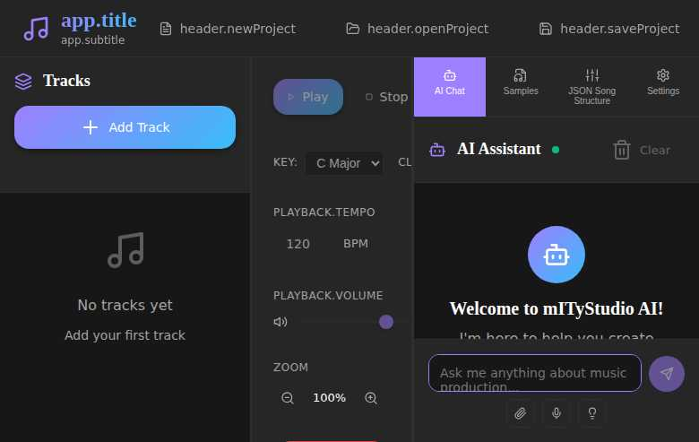

# 🎵 mITyStudio

**AI-Powered Digital Audio Workstation for the Modern Music Producer**



*Experience the future of music creation with AI-powered composition assistance, intuitive design, and professional-grade audio tools.*

## 🚀 What is mITyStudio?

mITyStudio is a revolutionary web-based Digital Audio Workstation (DAW) that combines the power of artificial intelligence with professional music production tools. Whether you're a seasoned producer or just starting your musical journey, mITyStudio empowers you to create, compose, and produce music like never before.

**Built for creators, powered by AI, accessible everywhere.**

## ✨ Key Features

### 🤖 AI-Powered Music Assistant
- **Intelligent Composition Help**: Get real-time suggestions for chord progressions, melodies, and arrangements
- **Smart Music Theory Guidance**: Learn as you create with contextual music theory advice
- **Creative Inspiration**: Break through creative blocks with AI-generated ideas and variations
- **Voice & Text Interaction**: Communicate with your AI assistant through voice or text

### 🎛️ Professional Audio Production
- **Multi-Track Timeline Editor**: Arrange your music with precision using our intuitive timeline interface
- **Real-Time Audio Processing**: Professional-grade audio effects powered by Tone.js
- **Sample Library Management**: Organize and access your sound library with advanced categorization
- **Live Playback Controls**: Real-time tempo, volume, and effect adjustments

### 🎹 Comprehensive Music Tools
- **Virtual Instruments**: Built-in synthesizers and samplers for any genre
- **Audio Effects Suite**: Reverb, delay, distortion, and more professional effects
- **Key & Scale Detection**: Automatic musical key detection and scale suggestions
- **Loop & Metronome**: Perfect timing tools for professional productions

### 🌍 Modern User Experience
- **Cross-Platform**: Works on any device with a modern web browser
- **Multi-Language Support**: Available in multiple languages
- **Dark/Light Themes**: Customize your workspace to match your style
- **Real-Time Collaboration**: Share and collaborate on projects seamlessly

## 🎯 Perfect For

- **Music Producers** seeking AI-powered workflow enhancement
- **Songwriters** looking for creative inspiration and composition assistance  
- **Educators** teaching music production and theory
- **Content Creators** needing original music for their projects
- **Musicians** wanting to explore new creative possibilities

## 🚀 Quick Start Guide

### Getting Started in 3 Easy Steps

#### 1. **Prerequisites**
- Node.js (v16 or higher recommended)
- npm or yarn package manager
- A modern web browser (Chrome, Firefox, Safari, Edge)

#### 2. **Installation**
```bash
# Clone the repository
git clone https://github.com/janvanwassenhove/mITyStudio.git

# Navigate to the project directory  
cd mITyStudio

# Install dependencies
npm install
```

#### 3. **Launch mITyStudio**
```bash
# Start the development server
npm run dev
```

🎉 **That's it!** Open your browser and go to `http://localhost:5173` to start creating music with AI assistance.

### Production Deployment

For production environments:

```bash
# Build for production
npm run build

# Preview the production build
npm run preview
```

## 🎼 How to Use mITyStudio

1. **Start a New Project**: Click "New Project" or begin with a blank canvas
2. **Add Your First Track**: Use the "Add Track" button to create your first audio track
3. **Get AI Assistance**: Open the AI Chat panel to get composition suggestions and guidance
4. **Build Your Song**: Drag and arrange clips on the timeline, adjust tempo and effects
5. **Export Your Creation**: Save and export your finished track in your preferred format

## 🌟 Learn More & Get Inspired

Visit **[mityjohn.com](https://mityjohn.com)** for:
- 📚 **Tutorials & Guides**: Learn advanced music production techniques
- 🎵 **Sample Projects**: Download example projects to study and remix  
- 💡 **Production Tips**: Professional insights and creative workflows
- 🔄 **Updates & News**: Stay updated with the latest mITyStudio features

## 🛠️ Technical Information

### Technology Stack

Built with modern, cutting-edge technologies:

- **Frontend Framework**: Vue 3 with Composition API and `<script setup>`
- **Language**: TypeScript for enhanced type safety and developer experience
- **Build Tool**: Vite for lightning-fast development and optimized builds
- **Audio Engine**: Tone.js for professional real-time audio processing
- **State Management**: Pinia for reactive application state
- **UI Components**: Lucide Vue for beautiful, consistent icons
- **Styling**: Modern CSS with custom properties and responsive design

### Development Commands

```bash
# Development server with hot reload
npm run dev

# Type checking and production build
npm run build

# Preview production build locally
npm run preview

# Generate documentation
npm run docs

# Code linting
npm run lint
```

## 🤝 Community & Support

### Get Help & Connect

- 🐛 **Bug Reports**: [GitHub Issues](https://github.com/janvanwassenhove/mITyStudio/issues)
- 💬 **Discussions**: [GitHub Discussions](https://github.com/janvanwassenhove/mITyStudio/discussions)  
- 📖 **Documentation**: Check out our [Architecture Guide](ARCHITECTURE.md)
- 🌐 **Blog & Updates**: [mityjohn.com](https://mityjohn.com)

### Contributing

We welcome contributions from the community! Whether it's:
- 🔧 Bug fixes and improvements
- ✨ New features and enhancements  
- 📚 Documentation improvements
- 🎵 Sample content and presets

## 📚 Additional Resources

- [Vue 3 Documentation](https://vuejs.org/) - Learn about the frontend framework
- [TypeScript Documentation](https://www.typescriptlang.org/) - Master type-safe development
- [Tone.js Documentation](https://tonejs.github.io/) - Explore audio programming possibilities
- [Vite Documentation](https://vitejs.dev/) - Understand the build system

## 📧 Contact & Support

For questions, support, or collaboration opportunities:

**Jan van Wassenhove**  
- 🌐 Website: [mityjohn.com](https://mityjohn.com)
- 📧 Email: Contact through website
- 💼 Project: [mITyStudio on GitHub](https://github.com/janvanwassenhove/mITyStudio)

---

**Ready to revolutionize your music production workflow?** 🎵  
[**Start Creating with mITyStudio Today!**](https://github.com/janvanwassenhove/mITyStudio)

*mITyStudio - Where AI meets creativity in music production.*
