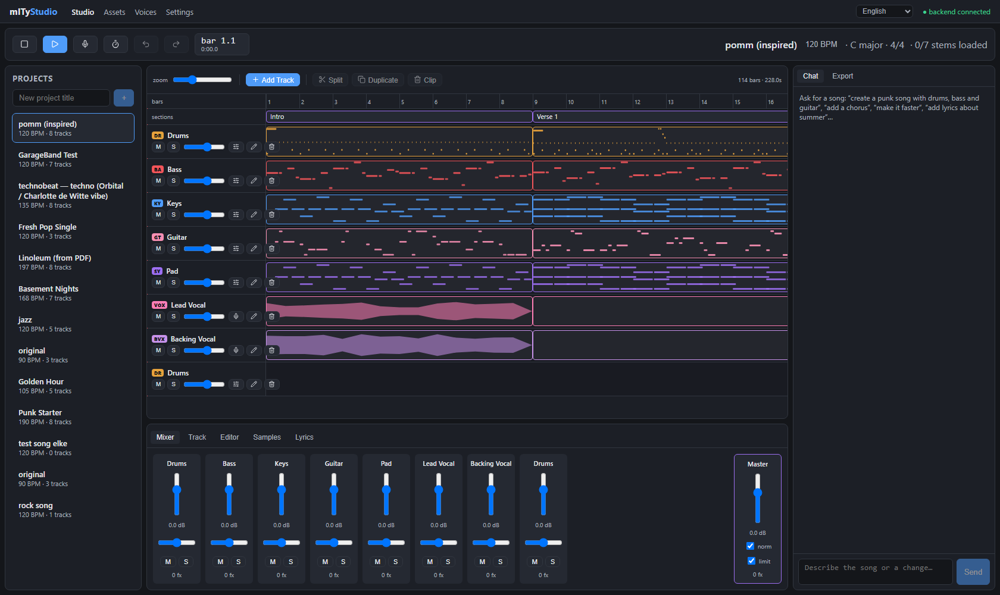
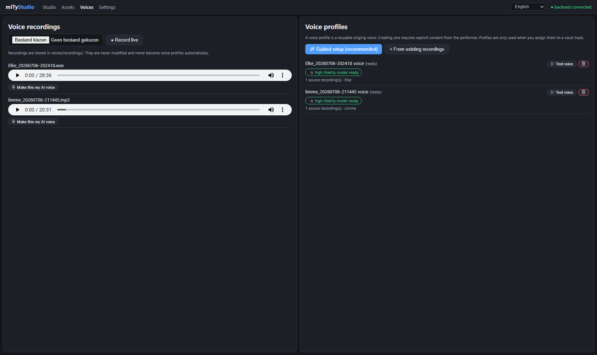

<div align="center">

# 🎛️ mITyStudio

**Your local AI music studio — describe a song, hear it sung in your own voice.**

Chat-driven composition · hands-on DAW editing · AI voice cloning with consent
· 4 languages (EN/NL/FR/DE) · 100% local-first



</div>

---

## Why mITyStudio

Most AI music tools are cloud black boxes: your voice, your lyrics and your
money go in, an MP3 comes out. mITyStudio is the opposite:

- **Local-first.** Your recordings, voice models, projects and API keys never
  leave your machine. Rendering (FluidSynth), voice cloning (XTTS + RVC) and
  mixing all run locally — GPU-accelerated when you have one.
- **A real studio, not a slot machine.** Every generated song lands as an
  editable multitrack project: piano rolls, beat grids, Smart Drums,
  draggable/resizable clips, per-track effects, a mixer, karaoke-synced
  lyrics with version history, and WAV/MP3 export.
- **The AI proposes, the engine disposes.** The LLM only ever emits
  structured, validated operations — it can't hallucinate audio, touch your
  files, or reference assets you don't have.
- **Your voice, with consent.** Voice profiles require explicit, recorded
  consent from the performer, stored as a permanent audit record. That's a
  feature, not a checkbox.

## What it does

| | |
|---|---|
| 💬 **Chat a song into existence** | *"create a punk song about summer with drums, bass, guitar and vocals"* → full arrangement with sections, instruments picked from **your** SoundFont library, lyrics, and a sung vocal — in the language you're chatting in. |
| 🎤 **AI singing in your voice** | A guided wizard records your voice (consent → range test → 10 coached exercises with live pitch feedback and quality checks), then trains a personal model on your GPU. Vocal tracks sing your lyrics with that voice — or record a take yourself and hear it converted to any of your voices. |
| 🥁 **Playable instrument surfaces** | Smart Drums board (drag pieces, the groove writes itself), step sequencer with genre patterns, playable drum pads, chord strips and keyboard — everything auditions with the real instrument sound and drops into the song as clips. |
| 📸 **Score & chord-sheet import** | Upload MIDI, MusicXML, Guitar Pro — or a **photo/PDF of a chord sheet**. Vision AI reads it; one click makes a full editable song. |
| 🎚️ **Real editing** | Split/duplicate/resize/drag clips, per-clip fades, piano roll & beat grid, per-track effects (reverb, delay, autotune, robot…), undo/redo, keyboard shortcuts, mixer with master bus. |
| 🌍 **4 languages, end to end** | UI, chat replies, singing pronunciation and karaoke timing in English, Nederlands, Français and Deutsch. |
| 📦 **Clean exports** | Combined WAV/MP3 mixdown, or a ZIP package with project JSON, MIDI, stems, lyrics + timing. |

<div align="center">



</div>

## Install

### Windows installer (recommended)
Grab the latest `mITyStudio-Setup-*.exe` from
[**Releases**](../../releases). Installing a newer version over an older one
**updates in place** — your workspace (projects, soundfonts, samples,
voices) is stored outside the install directory and is always preserved.
On first run you pick (or keep) a workspace folder; the app bootstraps its
own Python runtime and downloads FluidSynth/ffmpeg for you. Voice-cloning
extras install on demand.

### From source
```powershell
git clone https://github.com/janvanwassenhove/mITyStudio2.git
cd mITyStudio2
.\run-backend.ps1     # FastAPI on http://127.0.0.1:8000  (API docs at /docs)
.\run-frontend.ps1    # Vue studio on http://localhost:5173
.\run-tests.ps1       # pytest + vue-tsc
```
Requirements: Python 3.12, Node 20+. Recommended on PATH: **FluidSynth**
(instrument rendering) and **ffmpeg** (MP3 export, wide audio decoding).
Voice cloning additionally wants an NVIDIA GPU (works on CPU, slower) and
installs `apps/studio-api/requirements-voice.txt`.

## Five-minute tour

1. **Feed it your sounds** (the first-start guide walks you through this):
   drop `.sf2`/`.sf3` files in `soundfonts/`, audio in `samples/`, scores in
   `scores/` → Assets → **Rescan folders** → **Auto-tag all samples**.
2. **Make a song**: type in the chat — *"create a synthwave track at 105
   BPM in A minor with a dreamy pad, punchy drums and a sung chorus about
   neon rain"*. Press **▶** — stems render automatically.
3. **Create your AI voice**: Voices → **Guided setup**. Read the consent
   line aloud, do the range test, record the coached takes (aim for the
   10-minute meter), hit **Start training**. Training runs in the
   background; singing works immediately via zero-shot cloning and upgrades
   itself when the trained model is ready.
4. **Edit like a DAW**: double-click clips (or empty lane space) to open
   the editor — beat grid for drums, piano roll for melodies, play surfaces
   for jamming. Drag clip edges to resize, use ✂ to split at the playhead,
   set fades, click the BPM to retime the whole song.
5. **Sing it yourself**: open Lyrics → Karaoke, hit 🎙 in the transport and
   sing along — your take is placed on the vocal track and (if the track has
   a trained voice) automatically converted to that voice. This is the
   highest-fidelity vocal path in the studio.
6. **Export**: Export tab → **Export combined song** (WAV/MP3) or the full
   project package.

## Choose your AI brain

Out of the box the chat uses a deterministic offline planner (no key
needed). In **Settings** switch to Anthropic (Claude), OpenAI (GPT), or any
OpenAI-compatible endpoint — OpenRouter, Groq, Mistral, DeepSeek, or a fully
local Ollama/LM Studio. Keys are stored in a git-ignored local file (or env
vars) and are never returned by the API. Per-reply token usage is shown in
the chat so you always know what a request cost.
Details: [docs/llm-providers.md](docs/llm-providers.md).

## How the singing works (and how good it gets)

The vocal chain is *source singing → timbre conversion*: XTTS-v2 clones and
speaks your lyrics, a WORLD-vocoder stage sings them onto the melody
(sustain-looped vowels, breaths, vibrato, four delivery styles — sing / soft
/ powerful / rap), and a per-voice RVC model trained on your recordings
applies the final timbre. Backing vocals harmonize a diatonic third above
the lead. For the most natural result, sing a take yourself and let RVC
convert it. The full quality roadmap, objective validation harness and
listening protocol live in
[docs/singing-quality.md](docs/singing-quality.md).

## Documentation

| Doc | Contents |
|---|---|
| [docs/architecture-decisions.md](docs/architecture-decisions.md) | stack choices, repo inventory |
| [docs/project-structure.md](docs/project-structure.md) | folder layout, data ownership |
| [docs/local-development.md](docs/local-development.md) | dev setup, tests |
| [docs/desktop.md](docs/desktop.md) | Electron shell, installer, first-run bootstrap |
| [docs/assets.md](docs/assets.md) | asset registry, scanning rules |
| [docs/song-model.md](docs/song-model.md) | SongProject + PlaybackManifest |
| [docs/rendering.md](docs/rendering.md) | MIDI/stem/effects pipeline |
| [docs/singing-quality.md](docs/singing-quality.md) | vocal quality roadmap + validation |
| [docs/llm-providers.md](docs/llm-providers.md) | Claude/GPT/custom providers, key storage |
| [docs/voice-model.md](docs/voice-model.md) | voice safety, consent, engine contract |
| [docs/export.md](docs/export.md) | mix + package export |
| [docs/troubleshooting.md](docs/troubleshooting.md) | common issues |

## Architecture in one paragraph

Vue 3 + Pinia studio UI ⇄ FastAPI backend. The LLM returns structured
operations (`create_song`, `add_track`, `generate_drums`,
`rewrite_lyrics`, …) that are validated against the SQLite asset registry
before touching the project JSON. Renderers turn state into audio: mido →
FluidSynth for instruments, numpy DSP for samples/effects/mixdown,
XTTS + WORLD + RVC for vocals — all cached by content fingerprints so only
what changed re-renders. The Electron shell bundles a Python runtime and
bootstraps ML dependencies per machine.

## License & credits

Source © Jan Vanwassenhove. Built on excellent open source:
[FluidSynth](https://www.fluidsynth.org/), [Coqui XTTS-v2](https://github.com/coqui-ai/TTS)
(**Coqui Public Model License — non-commercial**; this constrains commercial
use of the built-in voice cloning), [Applio/RVC](https://github.com/IAHispano/Applio),
[pyworld](https://github.com/JeremyCCHsu/Python-Wrapper-for-World-Vocoder),
FastAPI, Vue, Lucide. SoundFonts, samples and voice recordings are **not**
distributed — you add your own after installation (per-folder READMEs tell
you where to find free content). Voice cloning requires the recorded,
explicit consent of the performer; don't clone voices you don't have rights
to.
