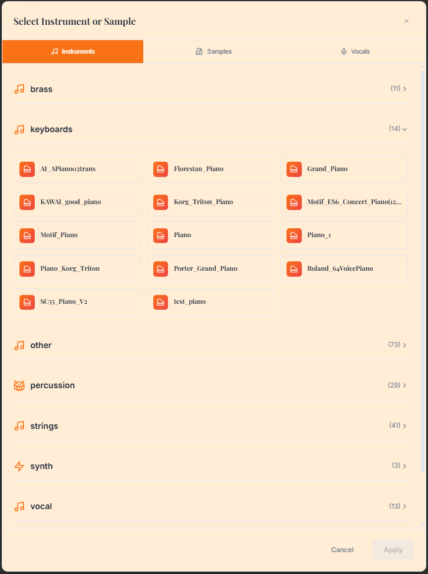

# AI Chat Instrument Awareness Enhancement

*The instrument selection interface that provides the AI chat with real-time awareness of available instruments*

## Problem
The AI chat was making instrument suggestions without knowing what instruments were actually available in the user's sample library. This led to suggestions for instruments that might not be available, making the action buttons less useful.

The instrument selection interface shown above demonstrates the comprehensive SoundFont library that the AI system now has full awareness of, enabling context-specific suggestions.

## Solution Implemented

### Backend Changes

1. **Enhanced AI Service Context (`backend/app/services/ai_service.py`)**
   - Modified `_build_system_prompt()` to dynamically include actual available instruments from the sample library
   - The system prompt now shows the real categories and instruments available
   - Falls back to generic descriptions if no instruments are provided

2. **AI Routes Enhancement (`backend/app/api/ai_routes.py`)**
   - Modified `/api/ai/chat` route to automatically include available instruments in the context
   - Uses `get_all_available_instruments()` to fetch current instruments from the sample library
   - Passes this information to the AI service for context-aware responses

### Frontend Changes

1. **Enhanced Instrument Parsing (`frontend/src/components/AIChat.vue`)**
   - Added `extractInstrumentFromContent()` function to validate AI-suggested instruments against available ones
   - Added `getInstrumentDisplayName()` to show user-friendly instrument names
   - Modified `parseMusicalSuggestions()` to use validated instruments

2. **Improved Action Button Generation**
   - Enhanced drum pattern actions to show specific available drum instruments
   - Bass track actions now display the actual bass instrument that will be used
   - Chord progression actions show the specific keyboard/piano instrument
   - Melody actions indicate which instrument will be used
   - Vocal track actions show available vocal instruments

## Benefits

1. **Context-Aware Suggestions**: AI now knows exactly what instruments are available
2. **Accurate Action Buttons**: When proposing "Add Drum Pattern", it shows which drum samples will actually be used
3. **Better User Experience**: Users see specific instruments (e.g., "Add Bass Line (Electric Bass)" instead of generic "Add Bass Line")
4. **No Invalid Suggestions**: AI won't suggest instruments that aren't available in the sample library

## Example Improvements

Before:
- "Add Drum Pattern" (generic)
- "Add Bass Line" (unknown instrument)
- AI might suggest unavailable instruments

After:
- "Add Drum Pattern (Roland TR-808)" (specific available drums)
- "Add Bass Line (Electric Bass)" (specific available bass)
- AI only suggests instruments that are actually in the sample library
- Action buttons show exactly what will be added

## Testing

1. Open the AI Chat
2. Ask "what instruments can I use for folk music?"
3. The AI should respond with only instruments available in your sample library
4. Action buttons should show specific instrument names from your library
5. When adding tracks, the AI uses instruments that actually exist

## Technical Details

- Available instruments are loaded from the file system (`frontend/public/instruments/`)
- Instruments are categorized (brass, keyboards, percussion, strings, synth, vocal, woodwinds)
- The AI system prompt is dynamically built with current instrument availability
- Frontend validates all AI suggestions against the available instrument list
- Fallback mechanisms ensure the system works even if instrument loading fails
