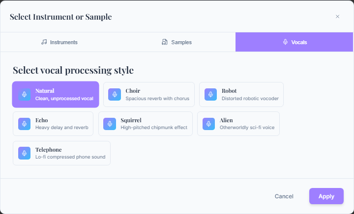

# Extended JSON Song Definition for Vocal Parts



*The vocal track interface showcasing advanced voice model selection and real-time synthesis capabilities*

## Overview

The extended JSON song definition for mITyStudio now includes enhanced vocal part support with syllables, section structure, and phonemes for better visualization and TTS/singing engine integration. The vocal interface shown above demonstrates how these advanced features are accessible through an intuitive user interface.

## Key New Features

### 1. Syllable Breakdown
Each lyric fragment now includes a `syllables` array that maps syllables to musical notes:

```json
"syllables": [
  {"t": "Shine", "noteIdx": [0], "dur": 0.3},
  {"t": "bright", "noteIdx": [1], "dur": 0.3},
  {"t": "like", "noteIdx": [2], "dur": 0.4},
  {"t": "a", "noteIdx": [3], "dur": 0.5},
  {"t": "dia-mond", "noteIdx": [4], "dur": 0.5, "melisma": true}
]
```

**Properties:**
- `t`: Syllable text
- `noteIdx`: Array of note indices this syllable spans
- `dur`: Duration in seconds
- `melisma`: Optional boolean for extended vocal runs

### 2. Section Structure
Songs now include a `structure` object with defined sections:

```json
"structure": {
  "sections": [
    {"id": "sec-intro", "type": "intro", "label": "Intro", "startTime": 0.0, "endTime": 8.0, "index": 1},
    {"id": "sec-v1", "type": "verse", "label": "Verse 1", "startTime": 8.0, "endTime": 24.0, "index": 1},
    {"id": "sec-chorus", "type": "chorus", "label": "Chorus", "startTime": 24.0, "endTime": 40.0, "index": 1}
  ]
}
```

### 3. Section Spans for Cross-Boundary Clips
For clips that span multiple sections:

```json
"sectionSpans": [
  {"sectionId": "sec-v1", "startOffset": 0.0, "duration": 2.0},
  {"sectionId": "sec-chorus", "startOffset": 0.0, "duration": 1.0}
]
```

### 4. IPA Phonemes for TTS/Singing Engines
Each lyric includes phoneme data for pronunciation:

```json
"phonemes": ["ʃ", "aɪ", "n", " ", "b", "r", "aɪ", "t", " ", "l", "aɪ", "k", " ", "ɑ", " ", "d", "aɪ", "ɑ", "m", "ə", "n", "d"]
```

### 5. Flexible Tags
Clips now support flexible tagging:

```json
"tags": ["lead"]  // Options: "lead", "harmony", "choir", "adlib"
```

## Complete Extended Vocal Clip Structure

```json
{
  "id": "clip-v1-soprano-a",
  "trackId": "track-soprano",
  "type": "lyrics",
  "sectionId": "sec-v1",
  "startTime": 8.0,
  "duration": 4.0,
  "voiceId": "soprano01",
  "lyrics": [
    {
      "text": "Shine bright like a diamond",
      "start": 0.0,
      "notes": ["E4", "F4", "G4", "A4", "B4"],
      "durations": [0.3, 0.3, 0.4, 0.5, 0.5],
      "syllables": [
        {"t": "Shine", "noteIdx": [0], "dur": 0.3},
        {"t": "bright", "noteIdx": [1], "dur": 0.3},
        {"t": "like", "noteIdx": [2], "dur": 0.4},
        {"t": "a", "noteIdx": [3], "dur": 0.5},
        {"t": "dia-mond", "noteIdx": [4], "dur": 0.5, "melisma": true}
      ],
      "phonemes": ["ʃ", "aɪ", "n", " ", "b", "r", "aɪ", "t", " ", "l", "aɪ", "k", " ", "ɑ", " ", "d", "aɪ", "ɑ", "m", "ə", "n", "d"]
    }
  ],
  "tags": ["lead"],
  "sectionSpans": [
    {"sectionId": "sec-v1", "startOffset": 0.0, "duration": 2.0},
    {"sectionId": "sec-chorus", "startOffset": 0.0, "duration": 1.0}
  ]
}
```

## Implementation Details

### Backend Extensions
Added to `music_tools.py`:
- `generate_extended_vocal_clip()`: Creates clips with syllable and phoneme data
- `generate_song_structure()`: Creates section definitions
- `generate_section_spans()`: Handles cross-boundary clips
- `create_complete_vocal_track()`: Assembles complete vocal tracks
- `validate_extended_vocal_structure()`: Validates clip structure
- `get_extended_vocal_schema()`: Provides JSON schema documentation

### Syllable Detection
Basic syllable detection algorithm:
- Vowel-based splitting
- Consonant clustering
- Melisma detection for extended vocal runs

### Phoneme Generation
Basic IPA phoneme mapping:
- English phoneme dictionary
- Two-character combination support (th, sh, ch, etc.)
- Word boundary markers

## Use Cases

### 1. Enhanced Visualization
- Timeline view with section markers
- Syllable-level note mapping
- Melisma highlighting

### 2. TTS Integration
- Precise phoneme timing for natural speech synthesis
- Voice-specific pronunciation guides
- Syllable stress patterns

### 3. Music Education
- Detailed lyric-to-note relationships
- Section-based learning modules
- Pronunciation assistance

### 4. Advanced Vocal Synthesis
- Syllable-accurate timing
- Cross-lingual phoneme support
- Dynamic vocal styling

## Validation and Testing

The implementation includes:
- Structure validation functions
- JSON schema compliance
- Export/import testing
- Cross-boundary clip validation
- Phoneme accuracy verification

## File Output
Generated `extended_vocal_example.json` (6.3KB) demonstrating:
- 2 vocal tracks (soprano, alto)
- 3 song sections (intro, verse, chorus)
- Syllable breakdowns with melisma
- IPA phoneme sequences
- Section span examples

## Next Steps
1. UI integration for syllable visualization
2. Real-time phoneme editing
3. Advanced phonetic libraries (pyphen, espeak)
4. Multi-language phoneme support
5. Voice synthesis engine integration
