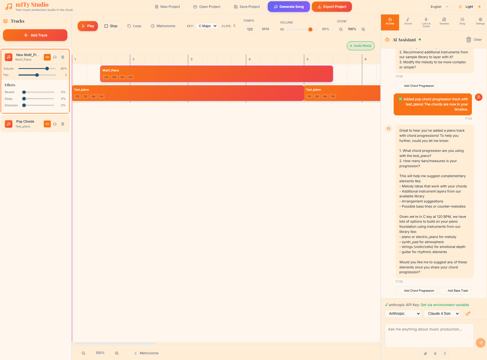
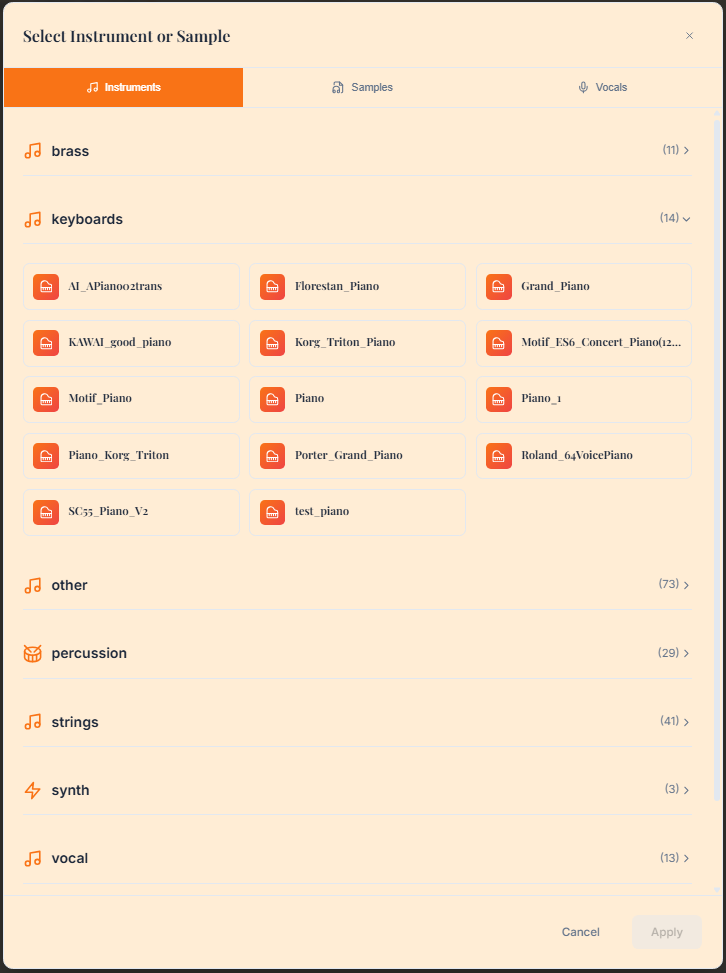

# mITyStudio Interface Quick Reference

A visual quick-reference guide to mITyStudio's key interfaces and their primary functions.

## 🎛️ Main Production Interface

**Primary Functions:**
- Multi-track timeline editing and arrangement
- Real-time audio preview and playback
- AI chat assistant for composition guidance
- Project management and workflow coordination

**Key Elements:**
- Timeline with multi-track layout
- Transport controls (play/pause/stop/record)
- Track mixer with individual volume controls
- AI assistant panel for intelligent suggestions
- Project browser and file management

---

## 📚 Sample Management

### Sample Library Overview

**Use Case:** Browse and organize your complete sample collection
- Categorized sample organization (drums, bass, leads, etc.)
- Real-time preview with automatic tempo detection
- Drag-and-drop integration with timeline tracks
- Search and filtering for quick sample location

### Track-Specific Sample Selection

**Use Case:** Choose samples for individual tracks with context awareness
- Filtered samples appropriate for current track type
- Visual waveform previews for informed selection
- Tempo sync and time-stretching options
- Layer multiple samples on single tracks

---

## 🎹 Instrument & Sound Design

**Use Case:** Access professional SoundFont instruments for MIDI tracks
- Comprehensive GM-compatible instrument library
- Category-based organization (strings, brass, percussion, etc.)
- Real-time preview with velocity sensitivity
- Multiple articulations per instrument family

**Workflow Integration:**
- Direct MIDI track assignment
- Real-time parameter control
- CPU-optimized streaming for complex arrangements
- Professional-quality sound synthesis

---

## 🎤 Vocal Production Suite

### Voice Model Management

**Use Case:** Advanced vocal synthesis with custom voice models
- Custom voice training using RVC technology
- Multi-speaker support for diverse vocal styles
- Real-time synthesis with lyrical input
- Automatic harmony generation and backing vocals

### Vocal Testing & Quality Assurance

**Use Case:** Evaluate voice model quality and synthesis accuracy
- Real-time voice model testing
- Pronunciation and articulation validation
- Quality metrics and performance analysis
- Fine-tuning controls for optimal results

---

## 🤖 AI-Powered Composition

**Use Case:** Comprehensive AI song generation with Multi-Agent System (MAS)
- Complete song structure generation (verse/chorus/bridge)
- Multi-agent coordination for professional arrangements
- Section-by-section review and modification
- Integration with existing project workflow

**MAS Components:**
- **Composer Agent:** Chord progressions and harmonic structure
- **Arrangement Agent:** Instrumentation and track layout
- **Lyrics Agent:** Contextual lyric generation with syllable mapping
- **Vocal Agent:** Voice synthesis and harmony coordination
- **Effects Agent:** Audio processing and spatial positioning
- **Review Agent:** Quality analysis and refinement suggestions

---

## 🎨 Visual Identity Creation

**Use Case:** AI-generated album artwork that complements your music
- Style matching based on musical genre and mood
- Automatic text integration (artist/album information)
- Multiple design variations for selection
- High-resolution export for digital and print distribution

---

## 🔄 Integrated Workflow Examples

### Complete Song Creation Workflow

1. **Start** → Sample Library or AI Generation
   

2. **Arrange** → Multi-track Timeline
   

3. **Enhance** → Instrument Selection
   

4. **Vocalize** → Voice Synthesis
   

5. **Review** → AI Analysis & Refinement
   

6. **Finalize** → Album Art Creation
   

### Rapid Prototyping Workflow

1. **AI Generation** → Complete song structure in minutes
2. **Sample Integration** → Replace AI-generated content with custom samples
3. **Vocal Enhancement** → Add custom voice models and harmonies
4. **Visual Completion** → Generate matching album artwork

### Professional Production Workflow

1. **Manual Composition** → Start with samples and instruments
2. **AI Assistance** → Get suggestions and arrangement ideas
3. **Vocal Recording** → Use custom voice models for consistent sound
4. **Quality Review** → AI-powered analysis and optimization
5. **Complete Package** → Music + matching visual identity

---

## 💡 Interface Design Principles

All mITyStudio interfaces follow consistent design principles:

- **Visual Feedback:** Real-time waveforms, previews, and status indicators
- **Context Awareness:** Filters and suggestions based on current workflow state
- **Non-Destructive Editing:** All changes can be undone or modified without data loss
- **Professional Quality:** Industry-standard features with intuitive accessibility
- **AI Integration:** Intelligent assistance without replacing creative control

---

*This quick reference provides visual context for each major interface component, enabling efficient navigation and workflow optimization in mITyStudio.*