# LangGraph Implementation Reference

This document provides technical implementation details for the LangGraph workflows in mITyStudio.

## Table of Contents

1. [Workflow Graph Construction](#workflow-graph-construction)
2. [State Schema](#state-schema)
3. [Agent Implementation Patterns](#agent-implementation-patterns)
4. [Decision Function Implementations](#decision-function-implementations)
5. [Error Handling Strategies](#error-handling-strategies)
6. [Performance Monitoring](#performance-monitoring)

---

## Workflow Graph Construction

### Graph Building Process


### Code Structure

```python
def _build_graph(self) -> None:
    """Build the LangGraph workflow"""
    workflow = StateGraph(SongState)
    
    # Add all agent nodes
    workflow.add_node("composer", self._composer_agent)
    workflow.add_node("arrangement", self._arrangement_agent)
    workflow.add_node("lyrics", self._lyrics_agent)
    workflow.add_node("vocal", self._vocal_agent)
    workflow.add_node("instrument", self._instrument_agent)
    workflow.add_node("effects", self._effects_agent)
    workflow.add_node("review", self._review_agent)
    workflow.add_node("design", self._design_agent)
    workflow.add_node("qa", self._qa_agent)
    
    # Linear progression
    workflow.add_edge("composer", "arrangement")
    workflow.add_edge("arrangement", "lyrics")
    
    # Conditional vocal path
    workflow.add_conditional_edges(
        "lyrics",
        self._vocal_decision,
        {
            "skip_vocal": "instrument",
            "include_vocal": "vocal"
        }
    )
    
    # Continue linear progression
    workflow.add_edge("vocal", "instrument")
    workflow.add_edge("instrument", "effects")
    workflow.add_edge("effects", "review")
    
    # Review decision point
    workflow.add_conditional_edges(
        "review",
        self._review_decision,
        {
            "revise": "composer",
            "continue": "design"
        }
    )
    
    # Final stages
    workflow.add_edge("design", "qa")
    workflow.add_edge("qa", END)
    
    self.graph = workflow.compile()
```

---

## State Schema

### SongState Data Structure


### Key State Fields

| Field | Type | Purpose | Updated By |
|-------|------|---------|------------|
| `request` | `SongGenerationRequest` | User input parameters | Initial state |
| `global_params` | `Dict` | Tempo, key, duration | Composer Agent |
| `arrangement` | `Dict` | Song structure & track plan | Arrangement Agent |
| `lyrics` | `Dict` | Section-based lyrics | Lyrics Agent |
| `vocal_assignments` | `Dict` | Voice-to-track mappings | Vocal Agent |
| `instrumental_content` | `Dict` | Instrument tracks & clips | Instrument Agent |
| `effects_assignments` | `Dict` | Audio effects per track | Effects Agent |
| `review_results` | `Dict` | Quality assessment | Review Agent |
| `album_art` | `str` | Generated cover image | Design Agent |
| `final_song_json` | `Dict` | Export-ready structure | QA Agent |
| `errors` | `List[str]` | Accumulated errors | All agents |
| `revision_count` | `int` | Revision tracking | Review decision |

---

## Agent Implementation Patterns

### Standard Agent Pattern

```python
async def _agent_name(self, state: SongState) -> SongState:
    """
    Agent description and responsibilities
    """
    # 1. Set current agent for tracking
    state.current_agent = "agent_name"
    
    # 2. Progress callback (optional)
    if self.progress_callback:
        await self._safe_progress_callback("Agent: Action description...", progress_percent, "agent_name")
    
    # 3. Early exit conditions (if applicable)
    if condition_to_skip:
        state.output_field = default_value
        return state
    
    # 4. Build LLM prompt
    prompt = f"""Agent instructions and context..."""
    
    try:
        # 5. Call LLM
        response = await self._call_llm_safely(prompt)
        
        # 6. Parse JSON response with fallback
        fallback_data = { "default": "values" }
        result = self._safe_json_parse(response, fallback_data)
        
        # 7. Validate and process results
        processed_result = self._validate_and_process(result, state)
        
        # 8. Update state
        state.output_field = processed_result
        
        # 9. Log success
        logger.info(f"Agent: Completed successfully")
        
    except Exception as e:
        # 10. Error handling
        safe_log_error(f"Agent error: {e}")
        state.errors.append(f"Agent: {str(e)}")
        
        # 11. Fallback behavior
        state.output_field = intelligent_fallback_data
    
    return state
```

### Validation Pattern

```python
def _validate_agent_output(self, data: Dict, state: SongState) -> Dict:
    """Validate and clean agent output"""
    validated = {}
    
    # Required field validation
    for required_field in ['field1', 'field2']:
        if required_field not in data:
            logger.warning(f"Missing required field: {required_field}")
            validated[required_field] = default_values[required_field]
        else:
            validated[required_field] = data[required_field]
    
    # Resource availability validation
    if 'instruments' in data:
        available_instruments = set()
        for category, instruments in state.available_instruments.items():
            available_instruments.update(instruments)
        
        validated_instruments = []
        for instrument in data['instruments']:
            if instrument in available_instruments:
                validated_instruments.append(instrument)
            else:
                logger.warning(f"Unavailable instrument: {instrument}")
        
        validated['instruments'] = validated_instruments
    
    return validated
```

---

## Decision Function Implementations

### Vocal Decision Function

```mermaid
graph TD
    Start([_vocal_decision called]) --> Check{state.request.is_instrumental}
    Check -->|true| LogSkip[Log: Skipping vocal agent]
    Check -->|false| LogInclude[Log: Including vocal agent]
    
    LogSkip --> ReturnSkip[return 'skip_vocal']
    LogInclude --> ReturnInclude[return 'include_vocal']
    
    ReturnSkip --> SkipResult[Workflow: lyrics → instrument]
    ReturnInclude --> IncludeResult[Workflow: lyrics → vocal → instrument]
    
    %% Styling
    classDef decisionNode fill:#fff3e0,stroke:#e65100,stroke-width:2px,color:#000
    classDef actionNode fill:#e3f2fd,stroke:#1565c0,stroke-width:2px,color:#000
    classDef resultNode fill:#e8f5e8,stroke:#2e7d32,stroke-width:2px,color:#000
    
    class Check decisionNode
    class LogSkip,LogInclude,ReturnSkip,ReturnInclude actionNode
    class SkipResult,IncludeResult resultNode
```



```python
def _vocal_decision(self, state: SongState) -> str:
    """Decision function to determine whether to include vocal processing"""
    if state.request.is_instrumental:
        logger.info("🎵 Workflow: Skipping vocal agent - instrumental track selected")
        return "skip_vocal"
    else:
        logger.info("🎤 Workflow: Including vocal agent - vocal track selected")
        return "include_vocal"
```

### Review Decision Function


```python
def _review_decision(self, state: SongState) -> str:
    """Decide whether to continue or revise based on review results"""
    # Always force continue after max revisions
    if state.revision_count >= state.max_revisions:
        logger.info(f"Forcing continue after {state.revision_count} revisions")
        return "continue"
    
    # Get review recommendation
    review_recommendation = state.arrangement.get("review_recommendation", "continue")
    
    # Conservative revision policy
    if review_recommendation == "revise":
        # Check for critical errors
        critical_errors = [error for error in state.errors 
                         if any(word in error.lower() for word in ['critical', 'missing required', 'invalid schema'])]
        
        if critical_errors and state.revision_count < 1:
            state.revision_count += 1
            logger.info(f"Allowing revision {state.revision_count} due to critical issues: {critical_errors[:2]}")
            return "revise"
        else:
            logger.info(f"Ignoring revision request - either no critical errors or already revised {state.revision_count} times")
            return "continue"
    
    logger.info("Review decision: continue to design phase")
    return "continue"
```

---

## Error Handling Strategies

### Multi-Level Error Handling


### Error Categories and Responses

| Error Category | Handling Strategy | Recovery Method |
|----------------|------------------|-----------------|
| **JSON Parse Error** | Use fallback data | Continue with defaults |
| **LLM Timeout** | Retry with shorter prompt | Fallback to simpler generation |
| **Resource Unavailable** | Substitute available resource | Log warning, continue |
| **Critical Schema Error** | Trigger revision | Return to composer (max 1x) |
| **System Error** | Graceful failure | Return error response to user |

### Fallback Data Strategy

```python
# Each agent maintains intelligent fallbacks
fallback_data = {
    "composer": {
        "tempo": 120,
        "key": "C",
        "timeSignature": [4, 4],
        "duration": 180,
        "reasoning": "Default parameters"
    },
    "arrangement": {
        "structure": default_structure,
        "tracks_needed": default_tracks,
        "arrangement_philosophy": "Simple arrangement"
    },
    # ... other agents
}
```

---

## Performance Monitoring

### Execution Flow Monitoring


### Performance Metrics

| Metric | Vocal Track | Instrumental Track | Improvement |
|--------|-------------|-------------------|-------------|
| **Average Generation Time** | 45-60 seconds | 35-45 seconds | ~20% faster |
| **Agent Count** | 9 agents | 8 agents | 1 agent skipped |
| **LLM Calls** | 9-10 calls | 8-9 calls | 1-2 fewer calls |
| **Memory Usage** | Standard | Reduced | Less vocal state |
| **Error Rate** | 3-5% | 2-3% | Simpler workflow |

### Timeout Configuration

```python
# Workflow timeout settings
config = {
    "recursion_limit": 50,  # Max workflow iterations
}

# Generation timeout
final_state = await asyncio.wait_for(
    self.graph.ainvoke(initial_state, config=config), 
    timeout=420.0  # 7 minutes total
)
```

### Resource Monitoring

```python
# Track resource usage per agent
resource_tracking = {
    "instruments_used": set(),
    "voices_assigned": set(),
    "samples_referenced": set(),
    "effects_applied": [],
    "llm_calls": 0,
    "generation_time": 0.0
}
```

This technical reference provides the implementation details necessary for understanding, maintaining, and extending the LangGraph workflow system in mITyStudio.
