# LangGraph Workflows Documentation

This document provides comprehensive diagrams and explanations of the different LangGraph workflows used in the mITyStudio song generation system.

## Overview

The mITyStudio song generation system uses a sophisticated multi-agent workflow powered by LangGraph. The system intelligently routes between different workflows based on user preferences and includes conditional logic for optimal generation.

## Table of Contents

1. [Complete Workflow Overview](#complete-workflow-overview)
2. [Vocal Track Workflow](#vocal-track-workflow)
3. [Instrumental Track Workflow](#instrumental-track-workflow)
4. [Agent Responsibilities](#agent-responsibilities)
5. [Decision Points](#decision-points)
6. [Error Handling & Revision Loop](#error-handling--revision-loop)

---

## Complete Workflow Overview

This diagram shows the full workflow with all possible paths and decision points:

```mermaid
graph TD
    Start([Start]) --> Composer[🎼 Composer Agent]
    Composer --> Arrangement[🎹 Arrangement Agent]
    Arrangement --> Lyrics[📝 Lyrics Agent]
    
    Lyrics --> VocalDecision{🎤 Vocal Decision}
    VocalDecision -->|is_instrumental: true| Instrument[🎸 Instrument Agent]
    VocalDecision -->|is_instrumental: false| Vocal[🎤 Vocal Agent]
    
    Vocal --> Instrument
    Instrument --> Effects[🎛️ Effects Agent]
    Effects --> Review[👥 Review Agent]
    
    Review --> ReviewDecision{📋 Review Decision}
    ReviewDecision -->|Critical Issues & < 1 revision| Composer
    ReviewDecision -->|Continue| Design[🎨 Design Agent]
    
    Design --> QA[✅ QA Agent]
    QA --> End([End])
    
    %% Styling
    classDef agentNode fill:#e1f5fe,stroke:#01579b,stroke-width:2px,color:#000
    classDef decisionNode fill:#fff3e0,stroke:#e65100,stroke-width:2px,color:#000
    classDef startEndNode fill:#e8f5e8,stroke:#2e7d32,stroke-width:2px,color:#000
    
    class Composer,Arrangement,Lyrics,Vocal,Instrument,Effects,Review,Design,QA agentNode
    class VocalDecision,ReviewDecision decisionNode
    class Start,End startEndNode
```

---

## Vocal Track Workflow

This diagram shows the workflow when users select vocal tracks (`is_instrumental: false`):

```mermaid
graph TD
    Start([🎵 Vocal Track Generation]) --> Composer[🎼 Composer Agent<br/>- Sets tempo, key, duration<br/>- Considers vocal range]
    
    Composer --> Arrangement[🎹 Arrangement Agent<br/>- Plans vocal + instrumental tracks<br/>- Includes voice assignments<br/>- Creates verse/chorus structure]
    
    Arrangement --> Lyrics[📝 Lyrics Agent<br/>- Generates lyrics for sections<br/>- Matches timing & meter<br/>- Emotional alignment]
    
    Lyrics --> Vocal[🎤 Vocal Agent<br/>- Assigns voices to lyrics<br/>- Creates vocal melodies<br/>- Handles harmonies]
    
    Vocal --> Instrument[🎸 Instrument Agent<br/>- Creates instrumental support<br/>- Complements vocal parts<br/>- Avoids vocal frequency ranges]
    
    Instrument --> Effects[🎛️ Effects Agent<br/>- Vocal reverb & processing<br/>- Instrumental effects<br/>- Mix balance]
    
    Effects --> Review[👥 Review Agent<br/>- Validates vocal assignments<br/>- Checks lyric timing<br/>- Ensures musical coherence]
    
    Review --> ReviewDecision{📋 Quality Check}
    ReviewDecision -->|Critical Issues| Composer
    ReviewDecision -->|✅ Good Quality| Design[🎨 Design Agent<br/>- Creates album cover<br/>- Considers lyrical themes]
    
    Design --> QA[✅ QA Agent<br/>- Final validation<br/>- Schema compliance<br/>- Export readiness]
    
    QA --> End([🎵 Complete Vocal Song])
    
    %% Styling
    classDef agentNode fill:#e3f2fd,stroke:#1565c0,stroke-width:2px,color:#000
    classDef decisionNode fill:#fff3e0,stroke:#e65100,stroke-width:2px,color:#000
    classDef startEndNode fill:#e8f5e8,stroke:#2e7d32,stroke-width:2px,color:#000
    
    class Composer,Arrangement,Lyrics,Vocal,Instrument,Effects,Review,Design,QA agentNode
    class ReviewDecision decisionNode
    class Start,End startEndNode
```

---

## Instrumental Track Workflow

This diagram shows the optimized workflow when users select instrumental tracks (`is_instrumental: true`):

```mermaid
graph TD
    Start([🎼 Instrumental Track Generation]) --> Composer[🎼 Composer Agent<br/>- Sets tempo, key, duration<br/>- No vocal range considerations<br/>- Style-appropriate parameters]
    
    Composer --> Arrangement[🎹 Arrangement Agent<br/>- Plans ONLY instrumental tracks<br/>- Filters out vocal tracks<br/>- Rich instrumental arrangements]
    
    Arrangement --> Lyrics[📝 Lyrics Agent<br/>- Skips lyric generation<br/>- Initializes empty vocal state<br/>- Quick pass-through]
    
    Lyrics --> SkipVocal{🎵 Skip Vocal Agent}
    SkipVocal -->|is_instrumental: true| Instrument[🎸 Instrument Agent<br/>- Creates melodic lead instruments<br/>- Rich layered arrangements<br/>- No vocal support needed]
    
    Instrument --> Effects[🎛️ Effects Agent<br/>- Instrumental-focused effects<br/>- Broader frequency processing<br/>- No vocal channel effects]
    
    Effects --> Review[👥 Review Agent<br/>- Validates instrumental completeness<br/>- Checks melodic structure<br/>- No vocal validation needed]
    
    Review --> ReviewDecision{📋 Quality Check}
    ReviewDecision -->|Critical Issues| Composer
    ReviewDecision -->|✅ Good Quality| Design[🎨 Design Agent<br/>- Creates album cover<br/>- Instrumental/cinematic themes]
    
    Design --> QA[✅ QA Agent<br/>- Final validation<br/>- No vocal schema checks<br/>- Export readiness]
    
    QA --> End([🎼 Complete Instrumental Song])
    
    %% Styling
    classDef agentNode fill:#f3e5f5,stroke:#7b1fa2,stroke-width:2px,color:#000
    classDef skipNode fill:#ffebee,stroke:#d32f2f,stroke-width:2px,color:#000
    classDef decisionNode fill:#fff3e0,stroke:#e65100,stroke-width:2px,color:#000
    classDef startEndNode fill:#e8f5e8,stroke:#2e7d32,stroke-width:2px,color:#000
    
    class Composer,Arrangement,Lyrics,Instrument,Effects,Review,Design,QA agentNode
    class SkipVocal skipNode
    class ReviewDecision decisionNode
    class Start,End startEndNode
```

---

## Agent Responsibilities

### 🎼 Composer Agent
- **Input**: User song request, style preferences
- **Output**: Global musical parameters (tempo, key, time signature, duration)
- **Key Functions**:
  - Analyzes style tags for appropriate tempo/key selection
  - Maps user preferences to musical parameters
  - Sets foundation for all subsequent agents

### 🎹 Arrangement Agent
- **Input**: Global parameters, available instruments/voices
- **Output**: Song structure, planned track layout
- **Key Functions**:
  - Creates song sections (intro, verse, chorus, bridge, outro)
  - Plans instrumental and vocal tracks
  - **Vocal Mode**: Includes vocal tracks with voice assignments
  - **Instrumental Mode**: Excludes all vocal tracks, focuses on melodic instruments

### 📝 Lyrics Agent
- **Input**: Song structure, request parameters
- **Output**: Section-based lyrics or empty state for instrumentals
- **Key Functions**:
  - **Vocal Mode**: Generates lyrics matching structure timing and emotional tone
  - **Instrumental Mode**: Skips lyric generation, initializes empty vocal assignments

### 🎤 Vocal Agent *(Conditional)*
- **Input**: Lyrics, available voices, musical parameters
- **Output**: Vocal track assignments and melodic content
- **Key Functions**:
  - Maps lyrics to melodic lines with notes and timing
  - Assigns available voices to different vocal parts
  - Creates polyphonic arrangements (lead, harmony, backing)
  - **Only runs for vocal tracks** (`is_instrumental: false`)

### 🎸 Instrument Agent
- **Input**: Planned tracks, available instruments/samples, structure
- **Output**: Complete instrumental track content
- **Key Functions**:
  - Creates clips for all non-vocal instruments
  - **Vocal Mode**: Creates supporting instrumental arrangements
  - **Instrumental Mode**: Creates rich, layered lead arrangements with prominent melodies

### 🎛️ Effects Agent
- **Input**: All tracks (vocal + instrumental)
- **Output**: Audio effects assignments per track/clip
- **Key Functions**:
  - Applies style-appropriate effects (reverb, delay, distortion)
  - **Vocal Mode**: Balances vocal and instrumental effects
  - **Instrumental Mode**: Focuses on instrumental processing

### 👥 Review Agent
- **Input**: Complete song structure
- **Output**: Quality assessment and revision recommendations
- **Key Functions**:
  - Validates schema completeness and musical coherence
  - Checks instrument/voice availability
  - **Vocal Mode**: Validates vocal assignments and lyric timing
  - **Instrumental Mode**: Focuses on instrumental structure validation

### 🎨 Design Agent
- **Input**: Complete song structure, request context
- **Output**: Album cover concept and image generation
- **Key Functions**:
  - Creates visual concept based on musical content
  - Generates DALL-E prompts and images
  - **Vocal Mode**: Considers lyrical themes
  - **Instrumental Mode**: Focuses on instrumental/cinematic themes

### ✅ QA Agent
- **Input**: Final song structure with album art
- **Output**: Export-ready song JSON
- **Key Functions**:
  - Final schema validation and cleanup
  - Ensures all required fields are present
  - Marks song as ready for export

---

## Decision Points

### 🎤 Vocal Decision (`_vocal_decision`)

```mermaid
graph TD
    Decision{🎤 Check is_instrumental}
    Decision -->|true| Skip[Skip Vocal Agent<br/>Go directly to Instrument Agent]
    Decision -->|false| Include[Include Vocal Agent<br/>Full vocal processing]
    
    Skip --> InstResult[📝 Result: Faster generation<br/>🎵 No vocal processing overhead<br/>🎸 Rich instrumental focus]
    Include --> VocalResult[📝 Result: Complete vocal processing<br/>🎤 Voice assignments<br/>🎵 Lyric-to-melody mapping]
    
    %% Styling
    classDef decisionNode fill:#fff3e0,stroke:#e65100,stroke-width:2px,color:#000
    classDef resultNode fill:#e8f5e8,stroke:#2e7d32,stroke-width:2px,color:#000
    
    class Decision decisionNode
    class Skip,Include,InstResult,VocalResult resultNode
```

### 📋 Review Decision (`_review_decision`)

```mermaid
graph TD
    Review{📋 Review Quality Assessment}
    Review --> CheckRevisions{Revision Count < 1?}
    
    CheckRevisions -->|Yes| CheckCritical{Critical Errors Found?}
    CheckRevisions -->|No| ForceContinue[Force Continue<br/>Prevent infinite loops]
    
    CheckCritical -->|Yes| Revise[Return to Composer<br/>Start major revision]
    CheckCritical -->|No| Continue[Continue to Design<br/>Quality acceptable]
    
    ForceContinue --> Continue
    Continue --> Design[🎨 Design Agent]
    Revise --> Composer[🎼 Composer Agent]
    
    %% Styling
    classDef decisionNode fill:#fff3e0,stroke:#e65100,stroke-width:2px,color:#000
    classDef actionNode fill:#e3f2fd,stroke:#1565c0,stroke-width:2px,color:#000
    classDef agentNode fill:#e1f5fe,stroke:#01579b,stroke-width:2px,color:#000
    
    class Review,CheckRevisions,CheckCritical decisionNode
    class ForceContinue,Continue,Revise actionNode
    class Design,Composer agentNode
```

---

## Error Handling & Revision Loop

The system includes sophisticated error handling and revision capabilities:

```mermaid
graph TD
    Start([Song Generation Start]) --> Agents[Multi-Agent Processing]
    
    Agents --> Review[👥 Review Agent]
    Review --> Assess{Quality Assessment}
    
    Assess -->|🟢 Good Quality| Success[Continue to Design]
    Assess -->|🟡 Minor Issues| Success
    Assess -->|🔴 Critical Issues| CheckLimit{Revision Count < 1?}
    
    CheckLimit -->|Yes| Revise[🔄 Increment Revision Count<br/>Return to Composer]
    CheckLimit -->|No| ForceComplete[⚠️ Force Complete<br/>Prevent Infinite Loop]
    
    Revise --> Composer[🎼 Composer Agent]
    Composer --> Agents
    
    ForceComplete --> Success
    Success --> Design[🎨 Design Agent]
    Design --> End([Completed Song])
    
    %% Critical Error Types
    CriticalErrors[📋 Critical Error Types:<br/>• Missing required schema fields<br/>• Invalid instrument assignments<br/>• Broken song structure<br/>• Impossible timing constraints]
    
    %% Styling
    classDef processNode fill:#e3f2fd,stroke:#1565c0,stroke-width:2px,color:#000
    classDef decisionNode fill:#fff3e0,stroke:#e65100,stroke-width:2px,color:#000
    classDef successNode fill:#e8f5e8,stroke:#2e7d32,stroke-width:2px,color:#000
    classDef warningNode fill:#fff8e1,stroke:#f57c00,stroke-width:2px,color:#000
    classDef infoNode fill:#f3e5f5,stroke:#7b1fa2,stroke-width:2px,color:#000
    
    class Agents,Review,Composer,Design processNode
    class Assess,CheckLimit decisionNode
    class Success,End successNode
    class ForceComplete,Revise warningNode
    class CriticalErrors infoNode
```

---

## Performance Optimizations

### Workflow Efficiency

1. **Conditional Vocal Processing**: Instrumental tracks skip the vocal agent entirely, reducing generation time by ~15-20%

2. **Smart Revision Limiting**: Maximum 1 revision prevents infinite loops while allowing quality improvements

3. **Early Validation**: Each agent validates inputs and provides fallbacks, reducing downstream failures

4. **Resource Awareness**: All agents only use available instruments/voices/samples, preventing resource errors

### State Management

The system uses a shared `SongState` object that accumulates information as it flows through agents:

```mermaid
graph LR
    State[🗃️ SongState]
    State --> Request[📝 User Request]
    State --> Global[🎼 Global Params]
    State --> Arrangement[🎹 Arrangement]
    State --> Lyrics[📄 Lyrics]
    State --> Vocal[🎤 Vocal Assignments]
    State --> Instrument[🎸 Instrumental Content]
    State --> Effects[🎛️ Effects]
    State --> Review[👥 Review Results]
    State --> Design[🎨 Album Art]
    State --> Final[✅ Final Song JSON]
    
    %% Styling
    classDef stateNode fill:#e1f5fe,stroke:#01579b,stroke-width:2px,color:#000
    classDef dataNode fill:#f3e5f5,stroke:#7b1fa2,stroke-width:1px,color:#000
    
    class State stateNode
    class Request,Global,Arrangement,Lyrics,Vocal,Instrument,Effects,Review,Design,Final dataNode
```

---

## Technology Stack

- **LangGraph**: Workflow orchestration and state management
- **LangChain**: LLM integration (OpenAI, Anthropic)
- **Python asyncio**: Asynchronous agent execution
- **JSON Schema**: Structured output validation
- **DALL-E 3**: Album cover image generation

This architecture provides a robust, scalable, and efficient system for generating high-quality musical compositions with both vocal and instrumental capabilities.
