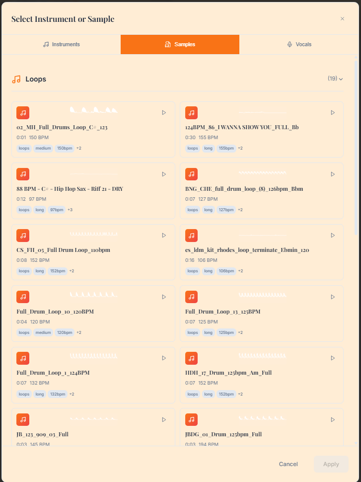

# mITyStudio Visual Interface Guide

This guide provides detailed explanations of mITyStudio's key interfaces and workflows, illustrated with screenshots from the actual application.

## 🎵 Main Interface Overview

The main mITyStudio interface provides a comprehensive music production environment featuring:

- **Multi-track timeline** - Visual arrangement of audio clips and MIDI data
- **AI Chat Assistant** - Context-aware assistance for composition and production
- **Real-time preview** - Instant playback of compositions with full mixing
- **Project management** - Save, load, and organize your musical projects
- **Integrated effects** - Professional audio processing capabilities

*Alternative interface configuration showing advanced features and workflow optimization*

## 📚 Sample Library Management

### Comprehensive Sample Browser

The Sample Library tab provides:

- **Categorized Organization**: Samples organized by type (drums, bass, leads, etc.)
- **Search Functionality**: Quick filtering to find specific sounds
- **Preview System**: Audition samples before adding to tracks
- **Metadata Display**: Key, tempo, and duration information for each sample
- **Drag & Drop Integration**: Easy addition to timeline tracks

**Key Features:**
- ✅ Real-time preview with tempo matching
- ✅ Automatic key detection and display
- ✅ Sample duration and loop information
- ✅ User ratings and favorites system
- ✅ Custom sample import and organization

### Track-Specific Sample Selection

When working with individual tracks, the sample selection interface offers:

- **Context-Aware Filtering**: Shows samples appropriate for the current track type
- **Visual Waveforms**: Preview sample content before selection
- **Tempo Sync Options**: Automatic time-stretching to match project tempo
- **Layer Management**: Combine multiple samples on single tracks
- **Real-time Replacement**: Swap samples while maintaining timing

**Workflow Benefits:**
- 🎯 Faster sample selection with intelligent filtering
- 🔄 Non-destructive sample swapping and testing
- 📊 Visual feedback on sample characteristics
- 🎛️ Immediate integration with track effects and processing

## 🎹 Instrument Selection & Management

The instrument selection panel provides comprehensive access to the SoundFont library:

**Organization Features:**
- **Category Browser**: Instruments grouped by family (strings, brass, percussion, etc.)
- **Search & Filter**: Quick location of specific instruments
- **Preview System**: Test instruments with sample phrases
- **Velocity Sensitivity**: Real-time response to playing dynamics
- **Articulation Selection**: Different playing techniques per instrument

**SoundFont Integration:**
- 🎼 Professional-quality GM (General MIDI) compatibility
- 🎵 Multi-sampling for realistic instrument response
- 🔊 Velocity layers for expressive performance
- 🎛️ Real-time parameter control (cutoff, resonance, etc.)
- 📈 CPU-optimized streaming for complex arrangements

**Usage Scenarios:**
1. **Quick Sketching**: Rapidly audition different instrument sounds
2. **Detailed Orchestration**: Layer multiple instruments for rich arrangements
3. **Performance Mode**: Real-time MIDI input with expressive response
4. **Sound Design**: Combine and modify SoundFont patches

## 🎤 Vocal Track Production

The vocal interface provides advanced voice synthesis and management capabilities:

**Voice Model Features:**
- **Custom Voice Training**: Create personalized voice models using RVC technology
- **Multi-Speaker Support**: Switch between different trained voices
- **Real-time Synthesis**: Generate vocal tracks with lyrical input
- **Harmony Generation**: Automatic creation of backing vocals and harmonies
- **Phoneme Control**: Precise pronunciation using IPA (International Phonetic Alphabet)

**Advanced Vocal Processing:**
- 🎵 **Syllable-to-Note Mapping**: Precise timing control for lyrical content
- 🎼 **Melisma Detection**: Automatic identification of extended vocal runs
- 🔄 **Cross-Section Clips**: Vocal parts that span multiple song sections
- 📍 **Stereo Positioning**: Spatial placement of vocal elements
- 🎛️ **Real-time Effects**: Reverb, delay, EQ, and compression

**Vocal Testing Interface**

*The vocal testing interface allows for real-time evaluation of voice models and synthesis quality*

### Workflow Integration
1. **Voice Model Selection**: Choose from pre-trained or custom voice models
2. **Lyrical Input**: Enter lyrics with optional phonetic annotations
3. **Melody Mapping**: Align syllables with musical notes
4. **Real-time Preview**: Hear synthesis results instantly
5. **Fine-tuning**: Adjust pronunciation, timing, and expression
6. **Track Integration**: Seamlessly add to multi-track arrangements

## 🤖 AI Song Generation & Review System

The Multi-Agent System (MAS) provides comprehensive AI-powered song generation with detailed review capabilities:

**Generation Process:**
1. **Style Input**: Specify genre, mood, and musical characteristics
2. **Structure Definition**: Set song sections (verse, chorus, bridge, etc.)
3. **AI Composition**: Multi-agent system creates complete arrangement
4. **Review Interface**: Evaluate generated content before integration
5. **Refinement Options**: Modify and regenerate specific sections

**Review Interface Features:**
- **Section-by-Section Analysis**: Detailed breakdown of each song part
- **Chord Progression Display**: Visual representation of harmonic structure
- **Lyrical Review**: Generated lyrics with syllable timing information
- **Arrangement Overview**: Track-by-track instrumentation details
- **Quality Metrics**: AI confidence scores and composition analysis

**Multi-Agent Coordination:**
- 🎼 **Composer Agent**: Creates chord progressions and song structure
- 🎹 **Arrangement Agent**: Determines instrumentation and track layout
- ✍️ **Lyrics Agent**: Generates contextual lyrics with syllable mapping
- 🎤 **Vocal Agent**: Handles vocal synthesis and harmony generation
- 🎛️ **Effects Agent**: Applies audio processing and spatial positioning
- ✅ **Finalization Agent**: Optimizes mix balance and final output

### Integration with Production Workflow
- **Accept/Reject Sections**: Keep only the parts that fit your vision
- **Regenerate Options**: Request alternative versions of specific sections
- **Manual Override**: Edit generated content while maintaining AI structure
- **Export to Timeline**: Seamlessly integrate approved content into your project
- **Learning Feedback**: System improves based on your preferences

## 🎨 Album Cover Generation

*AI-powered album artwork creation integrated with your musical compositions*

The album cover generation feature creates visual artwork that complements your music:

- **Style Matching**: Artwork style matches the musical genre and mood
- **Text Integration**: Automatic placement of artist and album information
- **Multiple Variations**: Generate several options for selection
- **High Resolution**: Export-ready quality for digital and print media
- **Custom Prompts**: Additional creative direction for specific visual themes

## 🔄 Workflow Integration

All interface components are designed to work seamlessly together:

1. **Start with Inspiration**: Use the sample library or AI generation
2. **Build Arrangement**: Layer instruments and samples on multiple tracks
3. **Add Vocals**: Generate or record vocal tracks with advanced processing
4. **Review and Refine**: Use the AI review system to evaluate and improve
5. **Final Production**: Apply effects, mix, and master your composition
6. **Complete Package**: Generate matching album artwork for distribution

## 💡 Pro Tips for Efficient Usage

### Sample Library Optimization
- **Use Search Keywords**: Tags like "upbeat", "dark", "acoustic" for quick filtering
- **Organize Favorites**: Build personal collections for frequent use
- **Preview in Context**: Audition samples with existing tracks for better fit

### Instrument Selection Strategy
- **Layer Complementary Sounds**: Combine multiple instruments for rich textures
- **Consider Frequency Ranges**: Avoid conflicts between similar-frequency instruments
- **Use Velocity Dynamics**: Take advantage of expressive SoundFont capabilities

### Vocal Production Workflow
- **Train Custom Voices**: Create unique vocal signatures for your projects
- **Plan Harmonies**: Use multi-voice capabilities for professional-sounding arrangements
- **Fine-tune Pronunciation**: Utilize phoneme control for clear articulation

### AI Generation Best Practices
- **Iterative Refinement**: Use multiple generation cycles to perfect sections
- **Hybrid Approach**: Combine AI generation with manual composition
- **Style Consistency**: Maintain coherent musical direction throughout projects

---

*This visual guide demonstrates mITyStudio's powerful interface design and comprehensive feature set, enabling both novice and professional musicians to create high-quality compositions efficiently.*